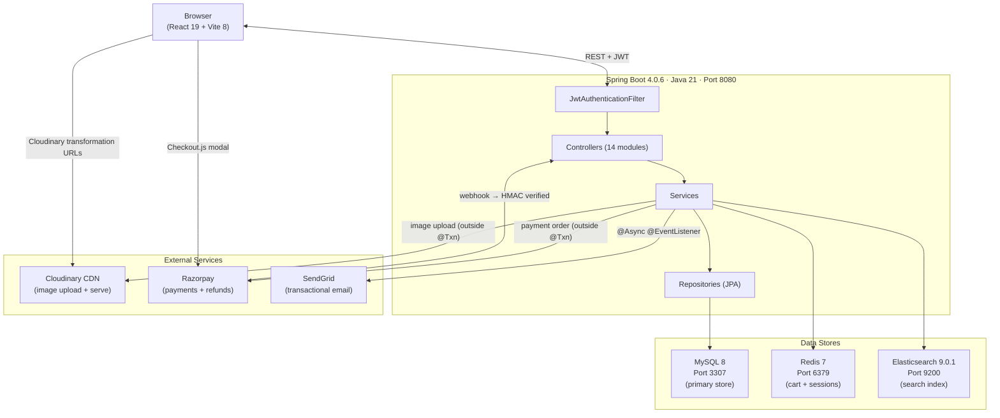
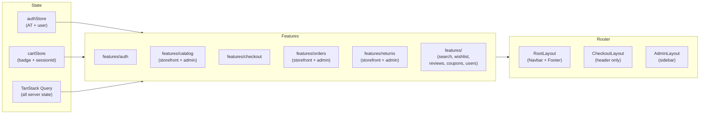
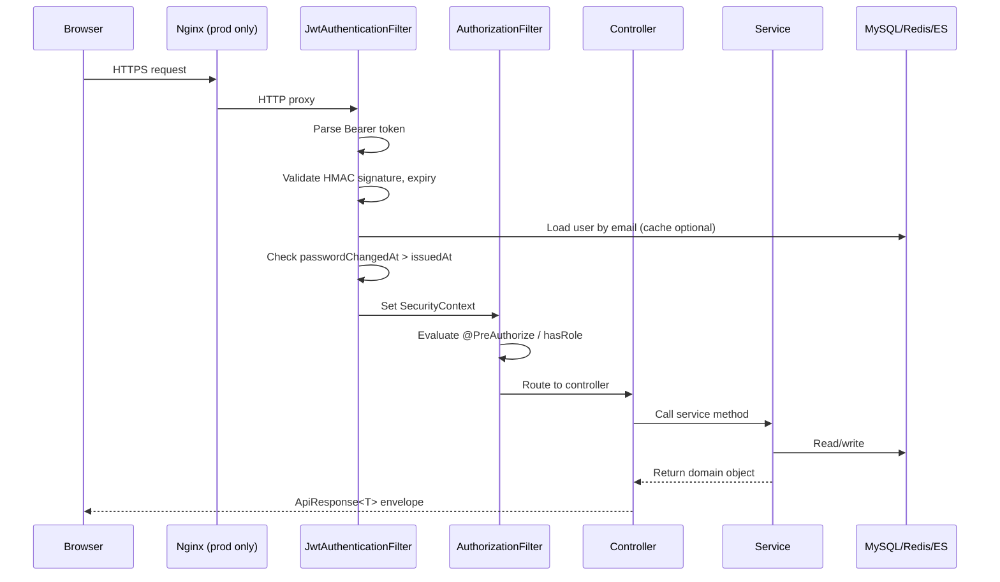

# System Overview — EGO Platform Architecture

> **Source-verified:** June 6, 2026. All component versions verified from `pom.xml` and `package.json`.

---

## High-Level Architecture



---

## Component Versions (Source-Verified)

| Component | Version | Source |
|---|---|---|
| Java | 21 | `pom.xml` `<java.version>` |
| Spring Boot | 4.0.6 | `pom.xml` `<parent>` |
| Spring Security | 7.x (bundled) | Spring Boot BOM |
| JJWT | 0.12.3 | `pom.xml` |
| Cloudinary SDK | 2.3.2 (`cloudinary-http5`) | `pom.xml` |
| SendGrid SDK | 4.10.2 | `pom.xml` |
| Razorpay SDK | 1.4.5 | `pom.xml` |
| Springdoc OpenAPI | Boot 4 compatible | `pom.xml` |
| React | 19.2.6 | `package.json` |
| TypeScript | ~6.0.2 | `package.json` |
| Vite | 8.0.12 | `package.json` |
| MUI (Material UI) | 9.0.1 | `package.json` |
| React Router DOM | 7.15.1 | `package.json` |
| TanStack Query | 5.100.11 | `package.json` |
| Zustand | 5.0.13 | `package.json` |
| Axios | 1.16.1 | `package.json` |
| Zod | 4.4.3 | `package.json` |
| MySQL | 8.0 | Docker |
| Redis | 7-alpine | Docker |
| Elasticsearch | 9.0.1 | Docker |

---

## Module Map

### Backend — 14 Feature Modules

```mermaid
graph TD
    common["common\n(ApiResponse, exceptions,\nHtmlSanitizer, SlugUtils)"]
    auth["auth\n(JWT, refresh tokens, RBAC)"]
    catalog["catalog\n(products, categories,\nvariants, EAV, images)"]
    cart["cart\n(Redis HASH, inventory holds)"]
    order["order\n(8-state machine, snapshots)"]
    payment["payment\n(Razorpay create + webhook)"]
    returns["returns\n(5-state machine, Razorpay refund)"]
    review["review\n(purchase-gated)"]
    wishlist["wishlist\n(variant-level, MySQL)"]
    coupon["coupon\n(FLAT/PERCENTAGE, checkout integration)"]
    notification["notification\n(5 async SendGrid events)"]
    search["search\n(ES 9.0.1, outbox pattern)"]
    address["address\n(address book, XSS-safe)"]
    admin["admin\n(KPI dashboard metrics)"]

    common --> auth
    common --> catalog
    common --> cart
    common --> order
    common --> payment
    common --> returns
    common --> review
    common --> wishlist
    common --> coupon
    common --> notification
    common --> search
    common --> address
    common --> admin
```



### Frontend — Feature-Sliced



---

## Request Lifecycle



---

## Data Flow Summary

| Operation | Flow |
|---|---|
| **Search** | Browser → `GET /search` → SearchService → ES (fallback: MySQL) |
| **Add to cart** | Browser → `POST /cart/add` → CartService (Redis HSET) + InventoryReservationService (MySQL optimistic lock) |
| **Checkout** | Browser → `POST /orders/checkout` → `@Transactional` {inventory commit + order persist + cart clear} → async email |
| **Payment** | Browser → Razorpay modal → Razorpay webhook → Backend HMAC verify → order CONFIRMED |
| **Product update** | Admin → `PUT /admin/products/{id}` → ProductService → MySQL + search_outbox → OutboxPoller (every 5s) → ES bulk index |
| **Return** | Customer → `POST /orders/{id}/returns` → ReturnService {window check} → Admin review → Razorpay refund API (outside @Txn) → inventory restore |

---

## Port Reference

| Service | Port |
|---|---|
| Backend (Spring Boot) | `8080` |
| Frontend (Vite dev server) | `5173` |
| MySQL | `3307` (host) → `3306` (container) |
| Redis | `6379` |
| Elasticsearch | `9200` |
| Swagger UI | `http://localhost:8080/docs` |

---

## Security Boundary

```
PUBLIC (no auth):          /api/v1/auth/register, /login, /refresh
                           /api/v1/categories/**
                           /api/v1/products/** (GET only)
                           /api/v1/search, /search/autocomplete
                           /api/v1/coupons/validate
                           /api/v1/webhooks/razorpay  (HMAC-secured)
                           /api/v1/*/reviews (GET only)
                           /docs/**

AUTHENTICATED (any role):  /api/v1/cart/**
                           /api/v1/orders/**
                           /api/v1/addresses/**
                           /api/v1/wishlist/**
                           /api/v1/payments/**
                           /api/v1/*/reviews (POST)
                           /api/v1/auth/logout, /me

ROLE_ADMIN only:           /api/v1/admin/**
```
