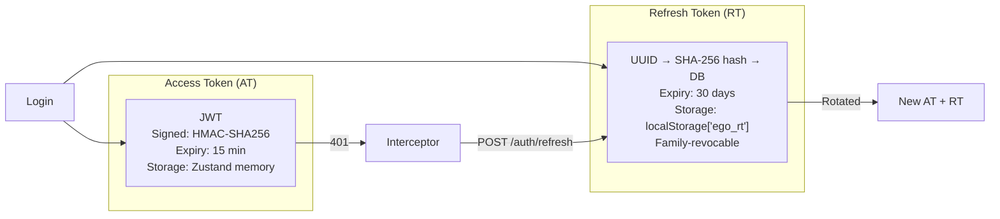

# Authentication

## What

JWT-based stateless authentication with refresh token rotation, family-based theft detection, email verification, and password reset. No server-side sessions — scales horizontally without sticky sessions.

## Backend

**Module:** `com.ego.raw_ego.auth`  
**Package structure:** `entity/` → `service/` → `security/` → `controller/`

**Key files:**

| File | Responsibility |
|---|---|
| `JwtService.java` | Issue, validate, parse AT claims. `passwordChangedAt` guard. |
| `RefreshTokenService.java` | RT rotation, SHA-256 hashing before storage, family revocation |
| `AuthService.java` | Register, login, logout, verify-email, forgot/reset-password orchestration |
| `JwtAuthenticationFilter.java` | `OncePerRequestFilter` — validates AT on every request |
| `SecurityConfig.java` | Filter chain, `PUBLIC_MATCHERS`, CORS, CSRF off |

## Token Design



## All Endpoints (Source-Verified from `AuthController.java`)

> ⚠️ **Correction from earlier docs:** The full list below is source-verified. Email verification and password reset are **implemented** — not stubs.

| Method | Path | Auth | Description |
|---|---|---|---|
| `POST` | `/api/v1/auth/register` | None | Create CUSTOMER account |
| `POST` | `/api/v1/auth/login` | None | Login → `{accessToken, refreshToken, user}` |
| `POST` | `/api/v1/auth/refresh` | None | Rotate RT → new AT + RT pair |
| `POST` | `/api/v1/auth/logout` | Bearer | Revoke RT + blocklist AT in Redis for remaining TTL |
| `GET` | `/api/v1/auth/me` | Bearer | Current user profile |
| `POST` | `/api/v1/auth/verify-email` | None (token param) | 24h JWT → set `emailVerified=true` |
| `POST` | `/api/v1/auth/resend-verification` | Bearer | Re-send 24h verification JWT email |
| `POST` | `/api/v1/auth/forgot-password` | None | Send 1h reset link. Always 200 (no user enumeration). |
| `POST` | `/api/v1/auth/reset-password` | None (token body) | Validate RESET JWT, hash new password, set `passwordChangedAt=now` |
| `POST` | `/api/v1/auth/logout-all` | ⚠️ Not implemented | Would revoke all RT families for user |

## Request Examples

**Register:**
```json
POST /api/v1/auth/register
{
  "firstName": "Rithik", "lastName": "A",
  "email": "rithik@ego.com",
  "password": "Secure@123",
  "phone": "+919876543210"
}
```

**Login response:**
```json
{
  "success": true,
  "data": {
    "accessToken": "eyJhbGciOiJIUzI1NiJ9...",
    "refreshToken": "550e8400-e29b-41d4-a716-446655440000",
    "tokenType": "Bearer",
    "expiresIn": 900,
    "user": {
      "id": 1, "email": "rithik@ego.com",
      "firstName": "Rithik", "lastName": "A",
      "role": "CUSTOMER", "emailVerified": false
    }
  }
}
```

**Forgot password:**
```json
POST /api/v1/auth/forgot-password
{ "email": "rithik@ego.com" }
// Always 200 regardless of whether email is registered
```

**Reset password:**
```json
POST /api/v1/auth/reset-password
{ "token": "<jwt-from-email>", "newPassword": "NewSecure@456" }
// Sets passwordChangedAt=now() → invalidates ALL existing ATs immediately
```

## Security Mechanisms

### `passwordChangedAt` Guard
After password reset, `user.passwordChangedAt` is set to `now()`. Any AT with `issuedAt < passwordChangedAt` is rejected — all outstanding ATs are immediately invalid without maintaining a blocklist.

### AT Logout Blocklist
`POST /auth/logout` adds the raw AT to a Redis key `blocklisted_at:{tokenHash}` with TTL = remaining validity. Next request with that AT hits blocklist check in `JwtAuthenticationFilter`.

### Family Revocation (Theft Detection)
- RT is rotated on every use (presented RT → revoked, new RT issued with same `family_id`)
- If a revoked RT is presented again → entire family revoked → all sessions from that login terminated
- Customer must log in again

### Password Policy
- Minimum 8 characters, maximum 72 (BCrypt truncation limit)
- Must contain: uppercase, lowercase, digit
- BCrypt strength 12 (~250ms/hash — brute-force resistant)

## Database

**`users` table (key columns):**

| Column | Notes |
|---|---|
| `id` | BIGINT UNSIGNED PK |
| `email` | UNIQUE, case-insensitive lookup |
| `password_hash` | BCrypt-12 |
| `first_name`, `last_name` | |
| `phone` | Optional |
| `role` | `CUSTOMER` or `ADMIN` |
| `is_active` | Soft suspend by admin |
| `is_email_verified` | Set true by `/auth/verify-email` |
| `password_changed_at` | Set by `/auth/reset-password` — guards outstanding ATs |
| `created_at`, `updated_at` | |

**`refresh_tokens` table:**

| Column | Notes |
|---|---|
| `token_hash` | SHA-256 of raw UUID — raw token never stored |
| `user_id` | FK → users.id |
| `family_id` | UUID grouping all RTs from one login session |
| `revoked` | Theft detection flag |
| `expires_at` | 30 days from issue |
| `created_at` | |

## Frontend

| File | Responsibility |
|---|---|
| `store/authStore.ts` | Zustand: `accessToken` (memory), `user` object, `setAuth()`, `clearAuth()` |
| `api/client.ts` | Axios interceptor with queue pattern for concurrent 401s |
| `features/auth/pages/LoginPage.tsx` | Login form → `useLogin()` mutation |
| `features/auth/pages/RegisterPage.tsx` | Register form → `useRegister()` mutation |
| `features/auth/pages/VerifyEmailPage.tsx` | Reads `?token=` param → `POST /auth/verify-email` |
| `features/auth/pages/ForgotPasswordPage.tsx` | Email form → `POST /auth/forgot-password` |
| `features/auth/pages/ResetPasswordPage.tsx` | Reads `?token=` param → `POST /auth/reset-password` |

**Boot sequence** (in `main.tsx`):
```
App loads
  → Read localStorage['ego_rt']
  → If exists: POST /auth/refresh
  → Success: setAuth(AT, user), store new RT
  → Failure: clearAuth()
```

## Error Codes

| HTTP | Scenario |
|---|---|
| `400` | Validation failure (email format, password policy, blank fields) |
| `401` | Wrong credentials, expired/invalid/revoked AT, invalid RT |
| `403` | Authenticated but insufficient role |
| `409` | Email already registered |
| `500` | Unexpected server error (stack trace never exposed) |

## Security Config

All auth endpoints in `SecurityConfig.PUBLIC_MATCHERS`:
- `/api/v1/auth/register`, `/api/v1/auth/login`, `/api/v1/auth/refresh`
- `/api/v1/auth/forgot-password`, `/api/v1/auth/reset-password`, `/api/v1/auth/verify-email`

`/api/v1/auth/logout` and `/api/v1/auth/resend-verification` require `authenticated()` (any valid AT).

## Known Limitations

- `logout-all` not implemented — one `POST /auth/logout` only revokes one RT + one AT
- Email verification not enforced at checkout — unverified users can place orders
- Rate limiting on `/auth/resend-verification` is implemented; `/auth/login` rate limit is ⚠️ not verified from source

## Source References

- `raw-ego/src/main/java/com/ego/raw_ego/auth/controller/AuthController.java` — source of truth for all endpoints
- `raw-ego/src/main/java/com/ego/raw_ego/auth/service/JwtService.java`
- `raw-ego/src/main/java/com/ego/raw_ego/auth/service/RefreshTokenService.java`
- `docs/backend/authentication-module.md` — detailed module structure
- `docs/security/refresh-token-architecture.md` — RT rotation deep dive
- ADR-003: [JWT + Refresh Token Strategy](../13-decisions/architecture-decision-records/ADR-003-jwt-refresh-token-strategy.md)
