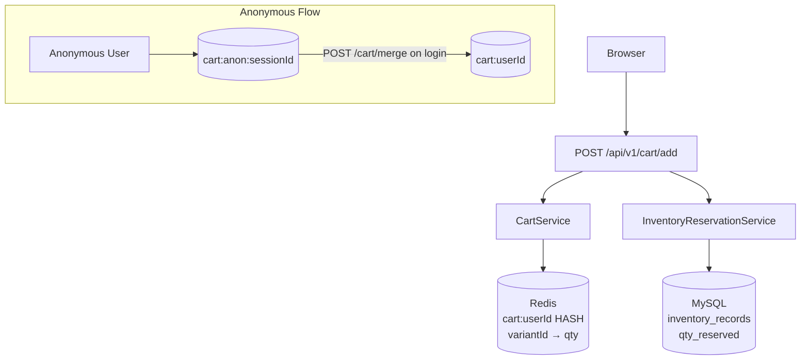
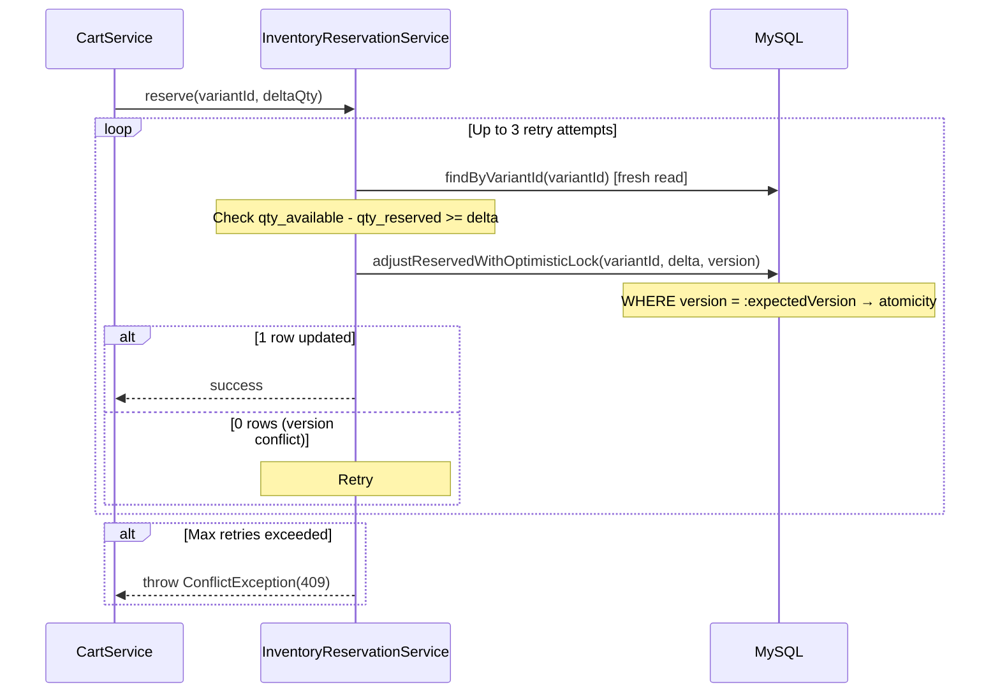

# Cart

## What

A Redis-backed shopping cart that supports authenticated users and anonymous browsing sessions. Every add/update operation automatically places a real inventory reservation — ensuring items in cart reflect actual available stock.

## Why

- **Redis (not MySQL):** Cart data is transient and mutation-heavy. Redis HASH operations are O(1) and don't hold transactions. MySQL would create N write transactions per cart interaction.
- **Inventory holds:** Without reservation, two users could both add the last unit to their carts and only one would fail at checkout. Reservations prevent overselling.
- **Anonymous cart:** Allows browsing + add-to-cart without login. Merges into user cart on authentication.

## Architecture



**Redis data model:**
- Key: `cart:{userId}` (authenticated) or `cart:anon:{sessionId}` (anonymous)
- Type: HASH — `{variantId}` → `{quantity}` (both stored as strings)
- TTL: 604800 seconds (7 days), **refreshed on every mutation**

## Backend

**Module:** `com.ego.raw_ego.cart`

| File | Responsibility |
|---|---|
| `CartService.java` | Redis HASH operations — add, update, remove, clear, merge |
| `InventoryReservationService.java` | `reserve()`, `release()`, `commit()`, `restore()` via optimistic lock |
| `CartController.java` | 6 REST endpoints |

**Inventory reservation flow:**



**`@Modifying(clearAutomatically = true)`** is required on `adjustReservedWithOptimisticLock` — prevents Hibernate 1st-level cache from returning stale `version` values between retry attempts.

**Cart GET — zero N+1 query guarantee:**
```
CartService.getCart():
  1. Redis HGETALL cart:{userId} → Map<variantId, qty>
  2. productVariantRepository.findAllById(variantIds) → one SQL query
  3. Silently drop variants not found (catalog-deleted items)
  4. Build CartItemResponse for each live variant
```

## Frontend

**State management:**
- `store/cartStore.ts` (Zustand): `itemCount` (badge count), `sessionId` (anonymous UUID from `crypto.randomUUID()`, persisted to `localStorage['ego_session_id']`)
- `api/cart.api.ts`: 6 API functions via `apiClient`
- `hooks/useCart.ts` (TanStack Query): `useCart`, `useAddToCart`, `useUpdateCartItem`, `useRemoveCartItem`, `useClearCart`, `useMergeCart`

**Cart merge on login:**
```typescript
// useAuth.ts — onSuccess handler
useLogin({
  onSuccess: () => {
    mergeCart(cartStore.sessionId);  // Merge anonymous cart
    cartStore.refreshBadge();        // Re-fetch badge count
  }
})

// useLogout — onSettled handler
useLogout({
  onSettled: () => cartStore.resetBadge()  // Zero badge on logout
})
```

**Optimistic UI:** Mutations use `queryClient.setQueryData()` for instant UI updates — no loading flash on quantity changes.

## Database

Cart data lives entirely in **Redis** — there is no `carts` MySQL table.

Inventory reservation data lives in MySQL:

**`inventory_records`** (relevant columns):
| Column | Type | Notes |
|---|---|---|
| `variant_id` | BIGINT UNSIGNED | FK, unique |
| `quantity_available` | INT | Units available for purchase |
| `quantity_reserved` | INT | Units currently in carts (held) |
| `version` | BIGINT | Optimistic lock — incremented on every update |

**Reservation accounting:**
- Add to cart: `quantity_reserved += delta`
- Remove from cart: `quantity_reserved -= delta`
- Checkout commit: `quantity_reserved -= delta`, `quantity_available -= delta`
- Order cancel / return: `quantity_available += delta` (reserve already released)

## API

### All endpoints require JWT authentication

| Method | Path | Description |
|---|---|---|
| `GET` | `/api/v1/cart` | Get full cart with live pricing |
| `POST` | `/api/v1/cart/add` | Add or increment item |
| `PUT` | `/api/v1/cart/items/{variantId}` | Set absolute quantity |
| `DELETE` | `/api/v1/cart/items/{variantId}` | Remove item |
| `DELETE` | `/api/v1/cart` | Clear entire cart |
| `POST` | `/api/v1/cart/merge` | Merge anonymous cart into user cart |

**POST /api/v1/cart/add:**
```json
// Request
{ "variantId": 5, "quantity": 2 }

// Response 200
{
  "items": [
    {
      "variantId": 5,
      "sku": "EGO-TEE-0001-BLK-M",
      "productName": "Classic Black Oversized Tee",
      "variantLabel": "Black / M",
      "price": 1299.00,
      "compareAtPrice": 1999.00,
      "discountPercent": 35,
      "primaryImageUrl": "https://res.cloudinary.com/...",
      "quantity": 2,
      "stockStatus": "IN_STOCK",
      "quantityAvailable": 10
    }
  ],
  "itemCount": 2,
  "subtotal": 2598.00
}
```

**POST /api/v1/cart/merge:**
```json
{ "sessionId": "8f3b2d91-..." }
```

## Validation Rules

- `quantity` must be ≥ 1
- `quantity` must not exceed `quantity_available` for variant → `409 Conflict`
- Variant must be `ACTIVE` → `404` if not found / not active
- Anonymous cart merge: if user already has items in cart + anonymous cart, quantities are summed (stock limits apply)

## Security

- All cart endpoints require authentication (`anyRequest().authenticated()`)
- Cart key is namespaced by `userId` — no cross-user access possible
- `POST /api/v1/cart/merge` validates the anonymous cart exists before merging

## Known Limitations

- Cart is Redis-only — lost if Redis is flushed or TTL expires (no fallback persistence to MySQL)
- Guest cart is lost if the user clears localStorage (session UUID is gone)
- No cross-device cart sync — cart is tied to the device that generated the `sessionId`
- See `BACKEND_REQUIREMENTS_FROM_FRONTEND.md` §4 for planned MySQL persistence for cross-device sync (P3 priority)

## Extension Points

- Cross-device cart: sync Redis cart to MySQL on checkout/logout; load on login
- "Save for later" list: promote cart item to a secondary Redis list
- Cart expiry notification: TTL-based Redis pub/sub event to notify user before cart expires

## Source References

- `raw-ego/src/main/java/com/ego/raw_ego/cart/service/CartService.java`
- `raw-ego/src/main/java/com/ego/raw_ego/cart/service/InventoryReservationService.java`
- `raw-ego-frontend/src/store/cartStore.ts`
