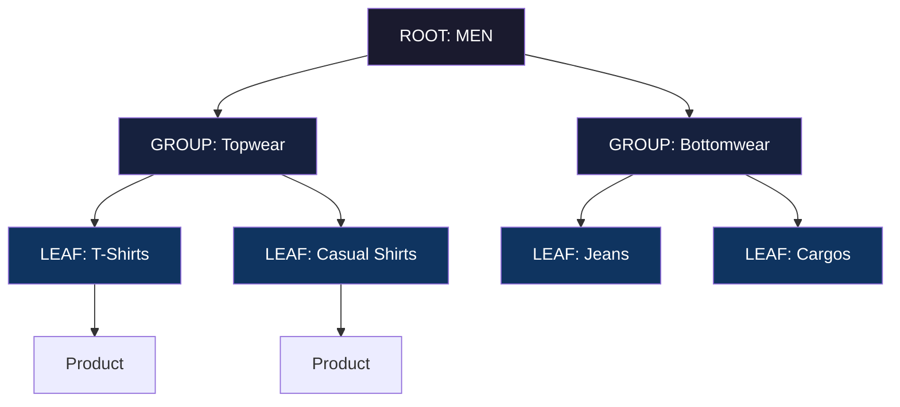
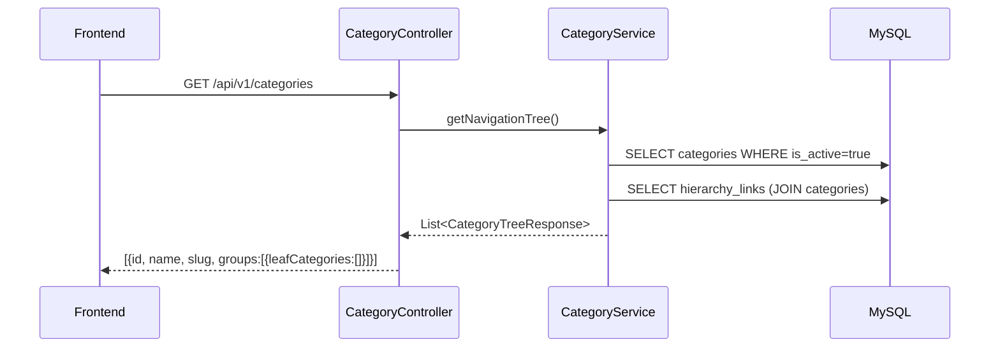
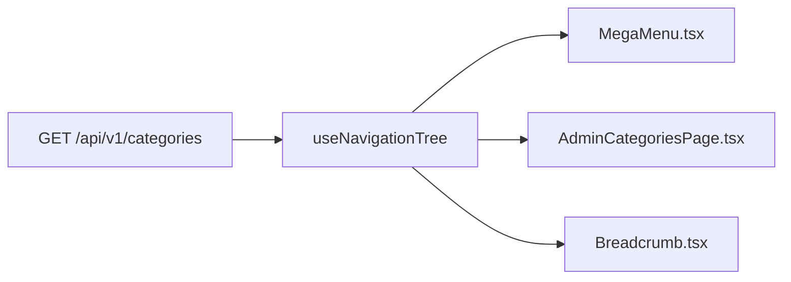

# Categories

## What

The EGO platform uses a **3-level category hierarchy**: ROOT → GROUP → LEAF.  
Products are assigned exclusively to LEAF categories. Navigation is rendered as a desktop mega-menu and mobile accordion drawer, both driven by the same API — no hardcoded category names anywhere in the codebase.

```
ROOT:   MEN, WOMEN, KIDS, HOME, BEAUTY
GROUP:  Topwear, Bottomwear, Footwear, Accessories
LEAF:   T-Shirts, Casual Shirts, Sneakers, Jeans, Cargos
```

## Why

Fashion retail requires deep category taxonomy for accurate product discovery. A flat or 2-level model forces users to browse "Men's Products" rather than "Men's T-Shirts." The 3-level tree enables:
- Mega-menu navigation with GROUP columns and LEAF links
- Hierarchy-aware search (`categorySlugPath` contains "men" → all MEN products)
- 3-level breadcrumbs: Home → MEN → Topwear → T-Shirts

## Architecture



## Backend

**Module:** `com.ego.raw_ego.catalog`

**Key files:**
| File | Description |
|---|---|
| `Category.java` | Self-referencing entity. `parent_id` FK, `level` enum (ROOT/GROUP/LEAF), `slug`, `code`, `is_active` |
| `CategoryHierarchyLink.java` | Cross-listing: one LEAF can appear under multiple GROUPs. Fields: `is_primary`, `display_order`, `is_visible`, `navigation_label` |
| `CategoryService.java` | Navigation tree, breadcrumbs, CRUD, depth validation |
| `CategoryController.java` | Public + admin REST endpoints |

**Service flow:**



**Depth enforcement rules (source-verified from `CategoryService.java`):**
- `createCategory()`: validates parent depth ≤ 1 (so child is at most depth 2 = LEAF)
- `isLeaf()`: a category has no active children
- `isRoot()`: `parent == null`
- `isGroup()`: has parent (is not root) AND has children (is not leaf)
- Products: `ProductService.createProduct()` calls `category.isLeaf()` — rejects assignment to ROOT or GROUP

## Frontend

**Components:**
| Component | Location | Description |
|---|---|---|
| `MegaMenu.tsx` | `features/navigation/` | Desktop: full-width panel. ROOT = hover tab, GROUP = column header, LEAF = clickable link |
| `AdminCategoriesPage.tsx` | `features/catalog/admin/pages/` | Admin CRUD with ROOT/GROUP/LEAF level badges |

**State:** Category tree fetched via `useNavigationTree()` TanStack Query hook — cached, shared across all navigation components.

**Data flow:**


## Database

**Tables:**

| Table | Key Columns |
|---|---|
| `categories` | `id`, `parent_id` (self-ref FK), `name`, `code` (immutable, in SKUs), `slug` (unique), `level` (ROOT/GROUP/LEAF), `display_order`, `is_active` |
| `category_hierarchy_links` | `parent_category_id` FK, `child_category_id` FK, `is_primary`, `display_order`, `is_visible`, `navigation_label` (override), UNIQUE(parent, child) |

**Indexes:** `parent_id`, `slug` (unique), `code` (unique)

**Current data (June 2026, verified):**
- 133 categories total
- 5 ROOT categories
- ~28 GROUP categories  
- ~100 LEAF categories
- 130 hierarchy links

## API

### Public Endpoints

**`GET /api/v1/categories`** — 3-level navigation tree
```json
[
  {
    "id": 1, "name": "MEN", "slug": "men", "level": "ROOT",
    "groups": [
      {
        "id": 10, "name": "Topwear", "slug": "topwear", "level": "GROUP",
        "leafCategories": [
          { "id": 50, "name": "T-Shirts", "slug": "t-shirts", "level": "LEAF" }
        ]
      }
    ]
  }
]
```

**`GET /api/v1/categories/leaves`** — Flat list of all LEAF categories (99 items)

**`GET /api/v1/categories/{slug}`** — Single category with level + breadcrumbs
```json
{ "id": 50, "name": "T-Shirts", "slug": "t-shirts", "level": "LEAF",
  "parent": { "id": 10, "name": "Topwear", "slug": "topwear" } }
```

**`GET /api/v1/categories/{slug}/breadcrumbs`** — Up to 3-item path
```json
[
  { "name": "MEN", "slug": "men" },
  { "name": "Topwear", "slug": "topwear" },
  { "name": "T-Shirts", "slug": "t-shirts" }
]
```

### Admin Endpoints (ROLE_ADMIN required)

| Method | Path | Description |
|---|---|---|
| `GET` | `/api/v1/admin/categories` | List all categories |
| `POST` | `/api/v1/admin/categories` | Create category |
| `PATCH` | `/api/v1/admin/categories/{id}` | Update details |
| `DELETE` | `/api/v1/admin/categories/{id}` | Soft-deactivate |
| `PATCH` | `/api/v1/admin/categories/{id}/activate` | Re-activate |
| `DELETE` | `/api/v1/admin/categories/{id}/permanent` | Hard-delete |
| `POST` | `/api/v1/admin/categories/{childId}/parents/{parentId}` | Add cross-listing |
| `PUT` | `/api/v1/admin/categories/{parentId}/children/reorder` | Reorder children |

## Validation Rules

- `name`: required, max 100 chars
- `code`: required, unique, UPPERCASE, max 10 chars, immutable after creation
- `slug`: auto-generated from `name` via `SlugUtils`, unique
- `parentId`: must reference an existing active category at depth ≤ 1 (so new category is LEAF)
- Products can only be assigned to LEAF categories (enforced in `ProductService`)
- Depth cap: max 3 levels (ROOT=0, GROUP=1, LEAF=2)

## Security

- All public category endpoints: `permitAll()` — no auth required
- All admin category endpoints: `ROLE_ADMIN` required
- `code` field is immutable — changing it would corrupt SKUs (rejected at service layer)

## Known Limitations

- A category is determined to be LEAF by having no active children — this means adding a sub-category to a LEAF automatically promotes it to GROUP. Products assigned to that category must be reassigned.
- `CategoryHierarchyLink` cross-listing is one-level-at-a-time; a LEAF appearing under multiple GROUPs requires one link per parent.
- No drag-and-drop reorder in admin UI — `display_order` is set via the reorder API.

## Extension Points

- To add a 4th level: change depth cap in `CategoryService`, update `CategoryTreeResponse` DTO shape, and update mega-menu to render 4 levels.
- To support category images: `image_url` column already exists in `categories` table — wire it into admin UI upload form and storefront rendering.

## Source References

- Backend: `raw-ego/src/main/java/com/ego/raw_ego/catalog/entity/Category.java`
- Backend: `raw-ego/src/main/java/com/ego/raw_ego/catalog/service/CategoryService.java`
- Frontend: `raw-ego-frontend/src/features/navigation/`
- Database: `docs/database/01_category_seed.sql`
- ADR: `docs/13-decisions/architecture-decision-records/ADR-001-category-architecture.md`
