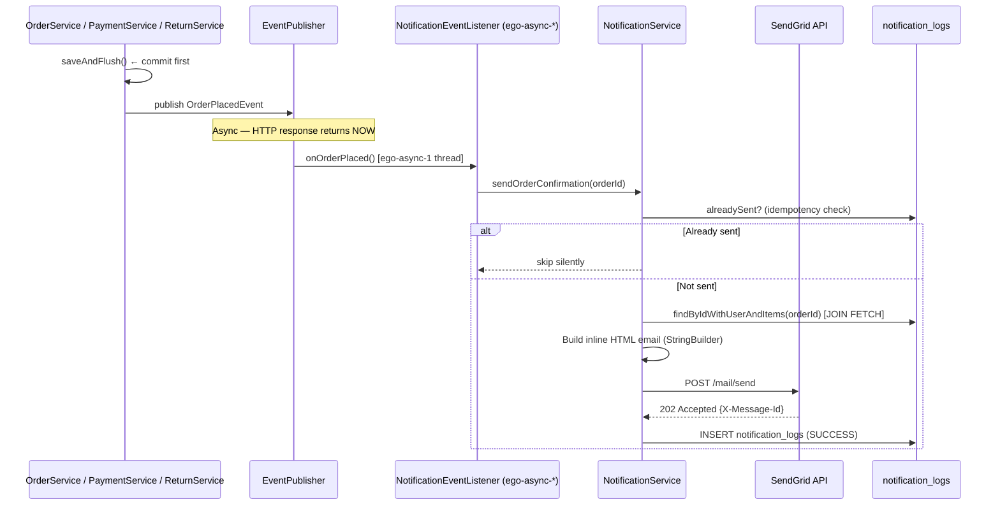

# Notifications (SendGrid)

## What

Asynchronous transactional email system powered by SendGrid. Emails are triggered by commerce lifecycle events and dispatched on a dedicated async thread pool — never blocking the HTTP response thread. All send attempts are logged to an audit table.

## Why

- **Async dispatch:** A slow SendGrid API call (500ms–3s) must never add latency to checkout or payment confirmation responses. The `@Async @EventListener` pattern decouples email delivery from the request lifecycle.
- **Idempotency:** Webhook retries and duplicate events must not send duplicate emails. Each send checks for an existing `SUCCESS` log entry before calling SendGrid.
- **Audit log:** Ops can diagnose delivery failures via `notification_logs` without access to SendGrid's dashboard.

## Architecture



## Notification Events (source-verified from `NotificationEventType.java`)

| Event | Enum Value | Trigger | Email Content |
|---|---|---|---|
| Order placed | `ORDER_PLACED` | `OrderService.checkout()` after `saveAndFlush()` | Order items, total, shipping address |
| Payment confirmed | `PAYMENT_CONFIRMED` | `PaymentService.confirmOrder()` after webhook | Payment receipt with order ref |
| Order shipped | `ORDER_SHIPPED` | Admin: order → `SHIPPED` | Shipping notification |
| Order delivered | `ORDER_DELIVERED` | Admin: order → `DELIVERED` | Delivery confirmation + review CTA + 7-day return reminder |
| Refund completed | `REFUND_COMPLETED` | `ReturnService`: refund → `REFUND_COMPLETED` | Razorpay refund ID + expected credit timeline |
| Email verification | `EMAIL_VERIFICATION` | ⚠️ **NOT YET IMPLEMENTED** — enum defined, no trigger wired | — |
| Password reset | `PASSWORD_RESET` | ⚠️ **NOT YET IMPLEMENTED** — enum defined, no trigger wired | — |
| Wishlist out of stock | `WISHLIST_OUT_OF_STOCK` | ⚠️ **NOT YET IMPLEMENTED** | — |
| Wishlist back in stock | `WISHLIST_BACK_IN_STOCK` | ⚠️ **NOT YET IMPLEMENTED** | — |

> **Important:** `EMAIL_VERIFICATION` and `PASSWORD_RESET` event types exist in the enum and are designed in the notification module, but the **triggering backend endpoints do not exist yet**. The frontend pages (`VerifyEmailPage`, `ForgotPasswordPage`, `ResetPasswordPage`) are UI stubs.

## Backend

**Module:** `com.ego.raw_ego.notification`

| File | Responsibility |
|---|---|
| `SendGridConfig.java` | Spring `@Bean` wiring `SendGrid` client from `SENDGRID_API_KEY` env var |
| `NotificationEventType.java` | All event type enum values |
| `NotificationStatus.java` | `SUCCESS`, `FAILED` |
| `NotificationLog.java` | Audit entity — `order_id`, `recipient_email`, `event_type`, `status`, `error_message`, `message_id` |
| `OrderPlacedEvent.java` | Spring `ApplicationEvent` — `orderId`, `userId` |
| `PaymentConfirmedEvent.java` | Same shape |
| `OrderShippedEvent.java` | Same shape |
| `OrderDeliveredEvent.java` | Same shape |
| `RefundCompletedEvent.java` | Adds `razorpayRefundId` field |
| `NotificationEventListener.java` | `@Async @EventListener` — routes each event to `NotificationService` method |
| `NotificationService.java` | Builds HTML email + calls SendGrid. **NOT `@Transactional`**. Uses `findByIdWithUserAndItems` JOIN FETCH to safely load order in async thread's own session. |
| `NotificationLogService.java` | Persists log rows in `@Transactional(REQUIRES_NEW)` — always commits independently |

**HTML builder note:** All HTML is built via `StringBuilder.append()` — never `String.format()` or `.formatted()`. This avoids `UnknownFormatConversionException` caused by `%` in CSS (e.g. `width="100%"`).

**Async thread pool config:**
```properties
spring.task.execution.pool.core-size=4
spring.task.execution.pool.max-size=8
spring.task.execution.thread-name-prefix=ego-async-
```

## Database

**Table: `notification_logs`**

| Column | Type | Notes |
|---|---|---|
| `id` | BIGINT UNSIGNED | PK |
| `order_id` | BIGINT UNSIGNED | FK → orders.id (nullable for non-order events) |
| `recipient_email` | VARCHAR(255) | Email address sent to |
| `event_type` | VARCHAR(50) | `NotificationEventType` value |
| `status` | VARCHAR(20) | `SUCCESS` or `FAILED` |
| `error_message` | VARCHAR(1000) | SendGrid error if `FAILED` (nullable) |
| `message_id` | VARCHAR(255) | SendGrid `X-Message-Id` header if `SUCCESS` (nullable) |
| `created_at` | DATETIME | Log timestamp |

## Configuration

| Property | Default | Notes |
|---|---|---|
| `SENDGRID_API_KEY` | `SG.placeholder` | Must be set — real key in `.env` |
| `SENDGRID_FROM_EMAIL` | `noreply@ego.com` | Must be verified sender in SendGrid dashboard |
| `sendgrid.from-name` | `EGO` | Display name in `From:` header |

> ⚠️ **Production:** `SENDGRID_FROM_EMAIL` (`dev-email@ego.com` in dev) must be changed to a verified branded address (e.g. `orders@ego.in`) and authenticated in SendGrid domain settings before launch.

## Security

- No auth required to trigger notifications (they are internal events)
- Idempotency prevents duplicate email spam on webhook retry storms
- `notification_logs` is write-only from the notification module — no customer-facing endpoint to read logs

## Known Limitations

- No in-app notification system — email only
- `EMAIL_VERIFICATION`, `PASSWORD_RESET`, `WISHLIST_*` events are defined but not wired
- No retry mechanism for `FAILED` logs — ops must manually re-trigger or it's lost
- Single SendGrid account — no failover to secondary provider

## Extension Points

- Wire `OrderShippedEvent` trigger in `OrderService.adminUpdateStatus()` when `status == SHIPPED`
- Wire `OrderDeliveredEvent` when `status == DELIVERED`
- Add `POST /api/v1/admin/notifications/{logId}/resend` — admin retry for FAILED logs
- Add a retry job: poll `notification_logs WHERE status='FAILED' AND retries < 3`
- Implement `EMAIL_VERIFICATION` endpoint (blocked: requires `email_verification_tokens` table)

## Source References

- `raw-ego/src/main/java/com/ego/raw_ego/notification/`
- `docs/database/schema_notification_logs.sql`
- `docs/integrations/sendgrid.md` (existing — verify against source)
