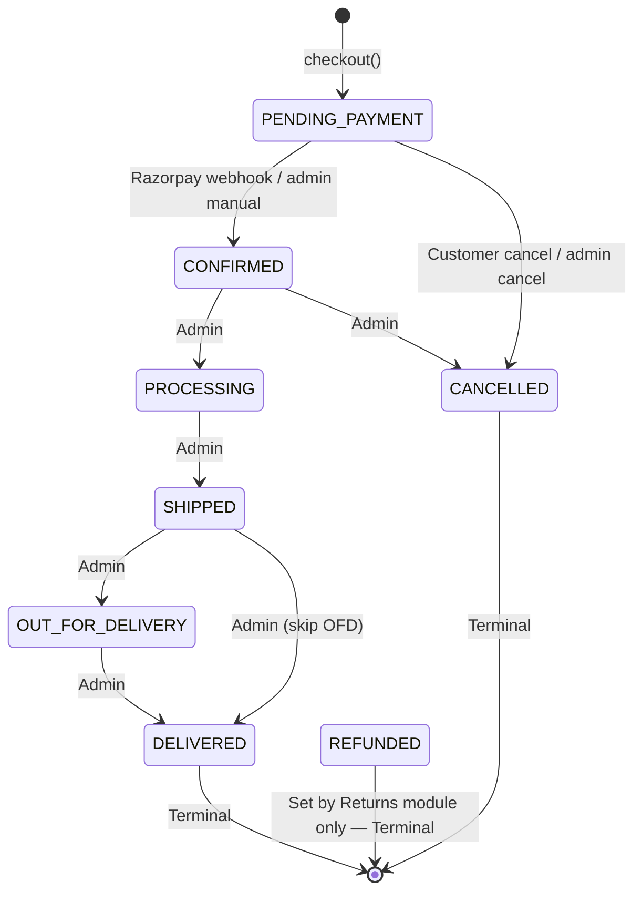
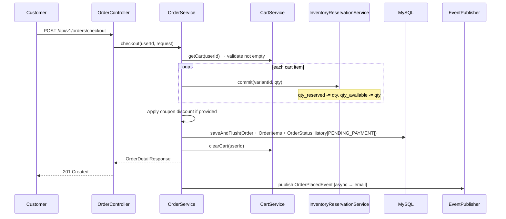
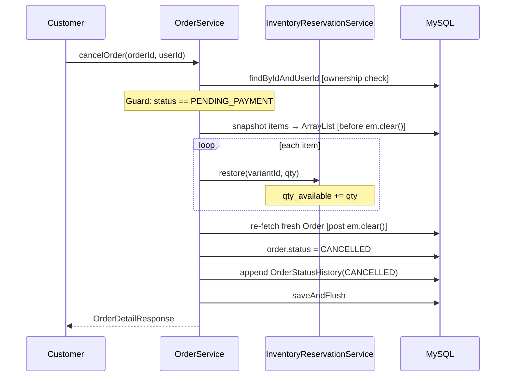

# Orders

## What

The order module manages the complete lifecycle of a customer purchase, from the moment of checkout through delivery (or cancellation/refund). It maintains an immutable record of what was purchased (snapshots) and an append-only audit trail of every status change.

## Why

- **Snapshot fields** protect order history from catalog mutations — product renames, price changes, and image deletions can never retroactively corrupt historical orders.
- **Append-only status history** provides a full audit trail for operations, customer disputes, and the return window calculation.
- **Optimistic locking** (`@Version`) prevents concurrent status updates from corrupting order state.

## Architecture

### Order Status Machine (source-verified from `OrderStatus.java`)



| Status | Description | Who sets it |
|---|---|---|
| `PENDING_PAYMENT` | Created at checkout; awaiting payment | System (checkout) |
| `CONFIRMED` | Payment confirmed | Razorpay webhook / Admin (COD) |
| `PROCESSING` | Warehouse picking/packing | Admin |
| `SHIPPED` | Handed to courier | Admin |
| `OUT_FOR_DELIVERY` | Last-mile delivery in progress | Admin |
| `DELIVERED` | Delivered to customer | Admin |
| `CANCELLED` | Cancelled before/during payment | Customer (PENDING_PAYMENT only) / Admin (PENDING_PAYMENT or CONFIRMED) |
| `REFUNDED` | Returned and refunded | **Returns module only** — never via admin status endpoint |

## Backend

**Module:** `com.ego.raw_ego.order`

| File | Description |
|---|---|
| `Order.java` | Core entity — `status`, `grandTotal`, `discountAmount`, `razorpayOrderId`, `razorpayPaymentId`, `@Version` |
| `OrderItem.java` | Line item with **5 immutable snapshots** |
| `OrderStatusHistory.java` | Append-only audit entry — `status`, `notes`, `created_at` |
| `OrderStatus.java` | State machine enum + `assertValidAdminTransition()` |
| `OrderService.java` | `checkout()`, `cancelOrder()`, `adminUpdateStatus()` |
| `OrderController.java` | 6 REST endpoints |
| `OrderRepository.java` | `findByIdAndUserId` (ownership-safe, returns 404 not 403) |

### OrderItem Snapshot Fields

```java
// These are written ONCE at checkout and NEVER mutated
String skuSnapshot;
String productNameSnapshot;
String variantLabelSnapshot;   // e.g. "Black / M"
String primaryImageUrlSnapshot;
BigDecimal unitPriceSnapshot;
```

### checkout() Pipeline — Single `@Transactional`



### cancelOrder() (Customer)



## Frontend

**Modules:** `features/orders/storefront/` and `features/orders/admin/`

| Component | Description |
|---|---|
| `CustomerOrdersPage.tsx` | Paginated list of customer's orders with status badges |
| `CustomerOrderDetailPage.tsx` | Order detail — items, status history, cancel button, return request trigger |
| `AdminOrdersPage.tsx` | Admin order list with status filter dropdown |
| `AdminOrderDetailPage.tsx` | Admin order detail — status update dropdown, history timeline |

**State:** TanStack Query hooks in `features/orders/hooks/useOrders.ts`

```typescript
useOrders(page)           // paginated customer order list
useOrder(id)              // single order detail
useCancelOrder()          // mutation → invalidates order cache
useCheckout()             // mutation → clears cart cache + resets badge
useCreatePayment()        // mutation → create Razorpay payment order
```

## Database

**Tables:**

### `orders`
| Column | Type | Notes |
|---|---|---|
| `id` | BIGINT UNSIGNED | PK |
| `user_id` | BIGINT UNSIGNED | FK → users.id |
| `status` | ENUM | `PENDING_PAYMENT, CONFIRMED, PROCESSING, SHIPPED, OUT_FOR_DELIVERY, DELIVERED, CANCELLED, REFUNDED` |
| `subtotal` | DECIMAL(10,2) | Sum of item prices before discount |
| `discount_amount` | DECIMAL(10,2) | Coupon discount applied (default 0) |
| `shipping_total` | DECIMAL(10,2) | Shipping cost |
| `grand_total` | DECIMAL(10,2) | `max(subtotal - discount, 0) + shipping_total` |
| `coupon_code_snapshot` | VARCHAR(50) | Coupon code used (nullable) |
| `shipping_address_snapshot` | TEXT/JSON | Full address captured at checkout |
| `razorpay_order_id` | VARCHAR(100) | Set on payment initiation (nullable) |
| `razorpay_payment_id` | VARCHAR(100) | Set on webhook confirmation (nullable) |
| `version` | BIGINT | Optimistic lock |
| `created_at` | DATETIME | Immutable |
| `updated_at` | DATETIME | Last mutation |

### `order_items`
| Column | Type | Notes |
|---|---|---|
| `id` | BIGINT UNSIGNED | PK |
| `order_id` | BIGINT UNSIGNED | FK → orders.id |
| `variant_id` | BIGINT UNSIGNED | FK → product_variants.id (for analytics only) |
| `quantity` | INT | Units purchased |
| `sku_snapshot` | VARCHAR(100) | Immutable — SKU at order time |
| `product_name_snapshot` | VARCHAR(255) | Immutable — name at order time |
| `variant_label_snapshot` | VARCHAR(255) | Immutable — e.g. "Black / M" |
| `primary_image_url_snapshot` | VARCHAR(500) | Immutable — image at order time |
| `unit_price_snapshot` | DECIMAL(10,2) | Immutable — price at order time |

### `order_status_history`
| Column | Type | Notes |
|---|---|---|
| `id` | BIGINT UNSIGNED | PK |
| `order_id` | BIGINT UNSIGNED | FK → orders.id |
| `status` | ENUM | Same as orders.status |
| `notes` | VARCHAR(500) | Admin notes (nullable) |
| `created_at` | DATETIME | **DELIVERED entry's `created_at` = return window start** |

## API

### Customer Endpoints (JWT required)

| Method | Path | Description |
|---|---|---|
| `POST` | `/api/v1/orders/checkout` | Place order (see checkout flow) |
| `GET` | `/api/v1/orders` | Paginated order list |
| `GET` | `/api/v1/orders/{id}` | Order detail with items + status history |
| `POST` | `/api/v1/orders/{id}/cancel` | Cancel `PENDING_PAYMENT` order only |

### Admin Endpoints (ROLE_ADMIN required)

| Method | Path | Description |
|---|---|---|
| `GET` | `/api/v1/admin/orders` | All orders with optional `?status=` filter |
| `PUT` | `/api/v1/admin/orders/{id}/status` | Update status — body: `{"status": "CONFIRMED", "notes": ""}` |

### Response Shape

```json
{
  "id": 42,
  "status": "CONFIRMED",
  "grandTotal": 2598.00,
  "discountAmount": 100.00,
  "couponCodeSnapshot": "SAVE100",
  "razorpayOrderId": "order_StWAmGXFqppm6W",
  "items": [
    {
      "variantId": 5,
      "quantity": 2,
      "skuSnapshot": "EGO-TEE-0001-BLK-M",
      "productNameSnapshot": "Classic Black Oversized Tee",
      "variantLabelSnapshot": "Black / M",
      "primaryImageUrlSnapshot": "https://res.cloudinary.com/...",
      "unitPriceSnapshot": 1299.00
    }
  ],
  "statusHistory": [
    { "status": "PENDING_PAYMENT", "createdAt": "2026-06-06T09:00:00Z" },
    { "status": "CONFIRMED", "notes": "Razorpay webhook", "createdAt": "2026-06-06T09:01:00Z" }
  ]
}
```

## Validation Rules

**Checkout:**
- Cart must not be empty → `400`
- All variants must be `ACTIVE` → `409`
- Stock available for all items → `409 Insufficient stock`
- Coupon code valid (if provided) → `400` / `409`

**Cancel:**
- Order must belong to requesting user → `404`
- Status must be `PENDING_PAYMENT` → `409`

**Admin status update:**
- Must follow valid state machine transition → `400 Invalid status transition`
- Cannot set `REFUNDED` via this endpoint → `400`

## Security

- `findByIdAndUserId()` — customer can only access their own orders (returns 404 not 403 to prevent order ID enumeration)
- Admin endpoints require `ROLE_ADMIN`
- `REFUNDED` status protected at state machine level — only `ReturnService` can set it
- Optimistic lock (`@Version`) prevents concurrent status corruption

## Known Limitations

- No tracking number / courier integration — `SHIPPED` and `OUT_FOR_DELIVERY` transitions have no structured tracking data attached (only admin `notes` field)
- No email notification for admin status changes beyond `ORDER_PLACED` and `PAYMENT_CONFIRMED`
- Bulk order status update not implemented (see `BACKEND_REQUIREMENTS_FROM_FRONTEND.md`)

## Extension Points

- Add `tracking_url` and `courier_name` columns to `orders` table — expose in admin status update request
- Add `OUT_FOR_DELIVERY` webhook trigger for real-time tracking
- Implement bulk status update endpoint: `PUT /api/v1/admin/orders/bulk-status`
- Add `DELIVERED` email notification trigger in `NotificationEventListener`

## Source References

- `raw-ego/src/main/java/com/ego/raw_ego/order/enums/OrderStatus.java`
- `raw-ego/src/main/java/com/ego/raw_ego/order/service/OrderService.java`
- `raw-ego/src/main/java/com/ego/raw_ego/order/entity/Order.java`
- `docs/database/schema_order_module.sql`
