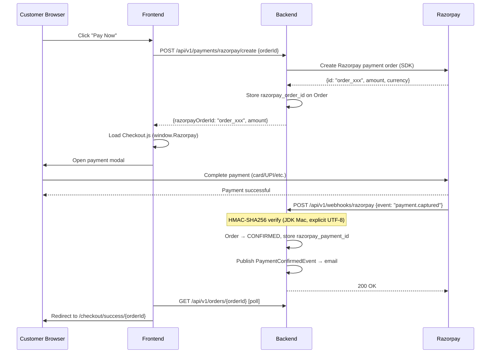

# Payments (Razorpay)

## What

Razorpay payment gateway integration for the Indian market. Supports credit/debit cards, UPI, netbanking, and wallets via Razorpay Checkout.js. Payment events are verified via HMAC-SHA256 webhook signatures.

## Why

- **Razorpay (not Stripe):** Indian market — Razorpay supports INR, UPI, and Indian payment instruments natively. Stripe has limited UPI support.
- **Webhook-based confirmation:** Payment is not confirmed by the frontend (easily spoofed) — only the Razorpay webhook with a valid HMAC signature triggers order confirmation.

## Architecture



## Backend

**Module:** `com.ego.raw_ego.payment`

| File | Responsibility |
|---|---|
| `RazorpayConfig.java` | Spring `@Bean` wiring `RazorpayClient` from env vars |
| `PaymentService.java` | `createRazorpayOrder()`, `handleWebhook()`, `confirmOrder()` |
| `PaymentController.java` | 2 endpoints: payment create + webhook receiver |

**HMAC Verification (critical implementation detail):**

```java
// PaymentService.java — webhook verification
// Uses JDK Mac, NOT Razorpay SDK Utils (charset bug on Windows)
Mac mac = Mac.getInstance("HmacSHA256");
SecretKeySpec secretKey = new SecretKeySpec(
    webhookSecret.getBytes(StandardCharsets.UTF_8), "HmacSHA256");
mac.init(secretKey);
byte[] hash = mac.doFinal(payload.getBytes(StandardCharsets.UTF_8));
String computed = bytesToHex(hash);
// Constant-time comparison
if (!MessageDigest.isEqual(computed.getBytes(), receivedSignature.getBytes())) {
    throw new WebhookSignatureException("Invalid signature");
}
```

**Why NOT `Utils.verifyWebhookSignature()`:** On Windows JVMs, default charset is `windows-1252` (not UTF-8). Razorpay SDK uses `payload.getBytes()` without specifying charset — this causes HMAC to be computed over different bytes than the incoming webhook payload encoded in UTF-8.

**Webhook controller reads raw bytes:**
```java
// PaymentController.java — reads raw bytes to avoid Spring charset transcoding
byte[] rawBytes = request.getInputStream().readAllBytes();
String rawBody = new String(rawBytes, StandardCharsets.UTF_8);
paymentService.handleWebhook(rawBody, signature);
```

**Idempotency:**
- `createRazorpayOrder()`: If order already has `razorpay_order_id`, returns existing ID (no duplicate Razorpay order)
- `handleWebhook()`: If order already `CONFIRMED`, logs duplicate and returns `200 OK` (Razorpay needs 200 to stop retrying)

## Frontend

| File | Description |
|---|---|
| `api/payment.api.ts` | `createPaymentOrder(orderId)` |
| `features/checkout/hooks/useRazorpay.ts` | Dynamically loads Checkout.js, exposes `openPaymentModal()` |
| `CheckoutPage.tsx` | "Pay Now" button triggers `useCreatePayment` → opens modal |
| `PaymentVerificationPage.tsx` | Polls order status until `CONFIRMED` |
| `OrderSuccessPage.tsx` | Final success page |

## Database Changes

Added in Phase 7 (via `schema_razorpay_columns.sql`):
```sql
ALTER TABLE orders ADD COLUMN razorpay_order_id VARCHAR(100) NULL;
ALTER TABLE orders ADD COLUMN razorpay_payment_id VARCHAR(100) NULL;
CREATE INDEX idx_orders_razorpay_order_id ON orders(razorpay_order_id);
```

## API

**`POST /api/v1/payments/razorpay/create`** (Customer JWT)
```json
// Request
{ "orderId": 42 }

// Response 200
{
  "razorpayOrderId": "order_StWAmGXFqppm6W",
  "amount": 259800,
  "currency": "INR",
  "keyId": "rzp_test_xxx"
}
```

**`POST /api/v1/webhooks/razorpay`** (Public — HMAC-secured)
- Header: `X-Razorpay-Signature: <hmac-sha256-hex>`
- Body: Razorpay JSON payload

**Security config:** `/api/v1/webhooks/**` in `PUBLIC_MATCHERS` — no JWT, but HMAC-secured.

## Validation Rules

- `orderId` must belong to the authenticated user → `404`
- Order must be in `PENDING_PAYMENT` status → `409`
- Webhook: invalid HMAC → `400 Bad Request` (Razorpay does not retry 4xx)
- Webhook: unrecognized order → `404` (logged, returns 200 to prevent Razorpay retry loop)

## Security

- Payment confirmation is ONLY triggered by server-side webhook verification
- Frontend never directly confirms payment — Checkout.js sends payment to Razorpay, Razorpay sends webhook to backend
- `RAZORPAY_WEBHOOK_SECRET` must never be exposed to frontend
- Live production requires switching from `rzp_test_*` to `rzp_live_*` credentials

## Known Limitations

- Razorpay refund live test deferred — requires real `pay_xxx` ID from production Checkout.js (not from test webhook simulation)
- COD (Cash on Delivery) orders cannot be auto-refunded via Returns module

## Source References

- `raw-ego/src/main/java/com/ego/raw_ego/payment/service/PaymentService.java`
- `raw-ego/src/main/java/com/ego/raw_ego/payment/controller/PaymentController.java`
- `docs/database/schema_razorpay_columns.sql`
- ADR-003: JWT strategy (stateless payment confirmation pattern)
