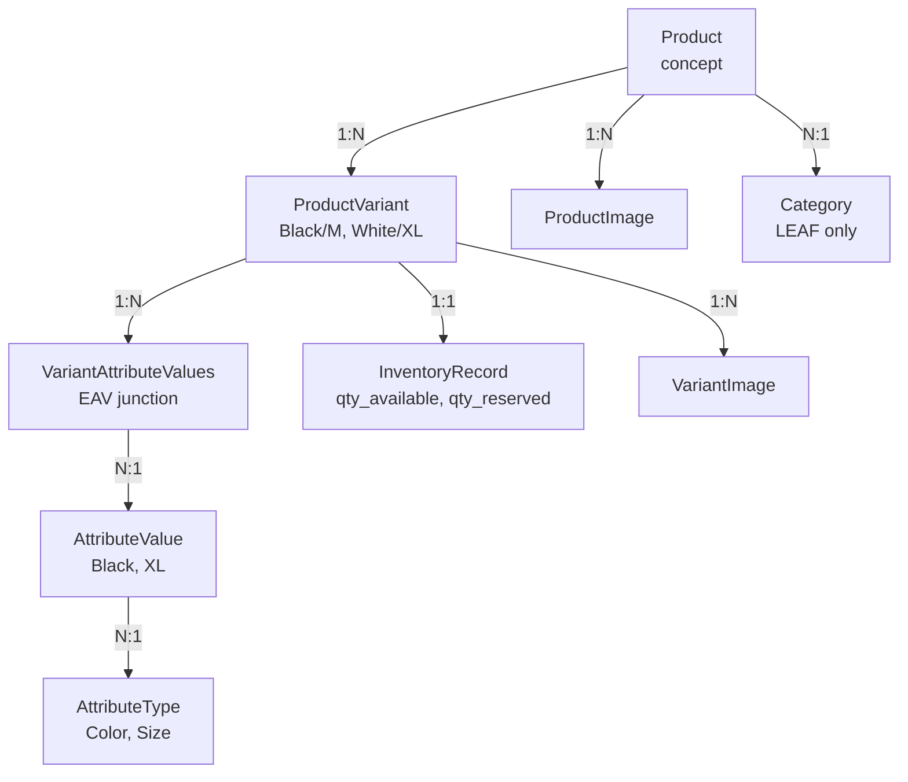
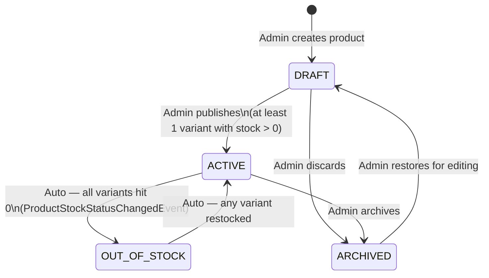
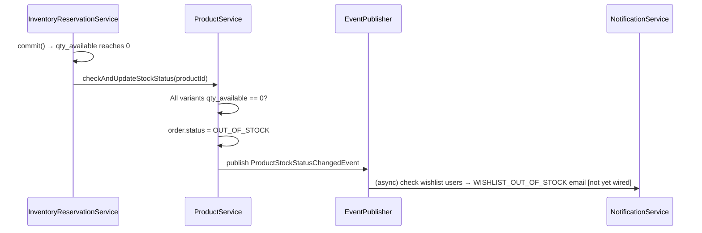

# Products

## What

The product catalog backbone. A `Product` is the concept ("Oversized Acid-Wash Tee"). Purchasable units are `ProductVariant` rows ("Black / M", "White / XL"). Cart, orders, inventory, and search all reference variants — never products directly.

## Why

- **Product / Variant split:** Avoids explosion of top-level product rows for color/size combinations. Customers browse the product and select attributes.
- **EAV attributes:** Admins define dimensions (Color, Size) and values (Black, M) without code changes. New attribute types (e.g. "Material") can be added from the admin UI.
- **Immutable SKU:** SKU is generated server-side at variant creation and never changes — it's embedded in order snapshots and warehouse systems.
- **`@SQLRestriction("is_deleted = false")`:** Soft-deleted products never appear in any query without explicit bypass — even joins don't see them.

## Architecture



## Product Status Machine (source-verified from `ProductStatus.java`)



| Status | Storefront visibility | Purchasable | Notes |
|---|---|---|---|
| `DRAFT` | Hidden | No | Default on creation |
| `ACTIVE` | Visible | Yes | At least one variant in stock |
| `OUT_OF_STOCK` | Visible + badge | No | Transitions auto via `ProductStockStatusChangedEvent` |
| `ARCHIVED` | Hidden | No | Admin can restore to DRAFT |

## Backend

**Module:** `com.ego.raw_ego.catalog`

| File | Responsibility |
|---|---|
| `Product.java` | Product entity. `@SQLRestriction("is_deleted = false")` — all queries auto-scoped. Tags: `@JdbcTypeCode(SqlTypes.JSON)` |
| `ProductVariant.java` | Variant entity. Immutable SKU. `price`, `compareAtPrice`, `costPrice` (never exposed in public API) |
| `InventoryRecord.java` | 1:1 with variant. `quantity_available`, `quantity_reserved`, `version` (optimistic lock) |
| `AttributeType.java` | EAV dimension (e.g. "Color", "Size") |
| `AttributeValue.java` | EAV option (e.g. "Black", "XL"). `hex_color` for swatch rendering |
| `ProductImage.java` | Gallery images. Cloudinary `public_id` + `secure_url`. `is_primary`, `display_order` |
| `VariantImage.java` | Variant-specific images (same schema as ProductImage) |
| `ProductService.java` | Storefront + admin product CRUD |
| `ProductVariantService.java` | Variant CRUD + SKU generation |
| `CloudinaryService.java` | Upload (outside `@Transactional`) + delete + URL transformations |
| `StockUrgencyService.java` | `lowStock` boolean + urgency message per variant |
| `InventoryService.java` | Admin inventory management |

### SKU Format (Immutable)

```
EGO-{CATEGORY_CODE}-{PRODUCT_CODE}-{COLOR_CODE}-{SIZE}
     └─ LEAF cat    └─ 4-digit seq  └─ abbreviated └─ abbreviated
        code field     per cat         color val      size val

Example: EGO-TEE-0001-BLK-M
```

- Generated server-side in `ProductVariantService.generateSku()`
- Stored as `UNIQUE` in `product_variants.sku`
- **Never changes** after creation — embedded in order snapshots

### Cloudinary Rule (CRITICAL)

```java
// ❌ WRONG — holds DB connection during upload (1–5 seconds)
@Transactional
public void upload(MultipartFile file, Long productId) {
    String url = cloudinaryService.upload(file); // HTTP call inside @Transactional
    imageRepository.save(new ProductImage(url, productId));
}

// ✅ CORRECT — split: upload first, then persist
public void upload(MultipartFile file, Long productId) {
    CloudinaryUploadResult result = cloudinaryService.upload(file); // Outside @Transactional
    imageService.persist(productId, result);                        // @Transactional starts here
}
```

### Cloudinary Transformation Sizes

| Name | Dimensions | Use case |
|---|---|---|
| `thumbnail` | 200×250px | Cart items, order summaries |
| `card` | 400×500px | Product listing grid cards |
| `detail` | 800×1000px | PDP main hero image |
| `zoom` | Up to 1600×2000px | PDP lightbox high-res |

URL pattern: `https://res.cloudinary.com/{cloud_name}/image/upload/c_fill,w_400,h_500/{public_id}.webp`

### Out-of-Stock Auto-Transition



## Frontend

| Component | Location | Description |
|---|---|---|
| `ProductDetailPage.tsx` | `features/catalog/storefront/pages/` | PDP — variant selector, gallery, add-to-cart |
| `ProductListingPage.tsx` | `features/catalog/storefront/pages/` | Search/category listing grid |
| `AdminProductsPage.tsx` | `features/catalog/admin/pages/` | Admin product list with status badges |
| `AdminProductDetailPage.tsx` | `features/catalog/admin/pages/` | Admin editor — upload images, manage variants, attributes |

**Variant selection UX:** Color swatches from `hex_color` on `AttributeValue`. Size buttons. Selecting a combination shows that variant's `price`, `compareAtPrice`, stock status, and primary image.

## Database

### `products`

| Column | Type | Notes |
|---|---|---|
| `id` | BIGINT UNSIGNED | PK |
| `category_id` | BIGINT UNSIGNED | FK → categories.id (LEAF only — enforced in service) |
| `name` | VARCHAR(255) | Display name |
| `product_code` | VARCHAR(10) | `UNIQUE`, 4-digit zero-padded (e.g. `0001`) — part of SKU |
| `slug` | VARCHAR(255) | `UNIQUE`, SEO-friendly URL (auto-generated) |
| `description` | TEXT | Long-form description |
| `tags` | JSON | `List<String>` — used in ES full-text boost |
| `status` | ENUM | `DRAFT, ACTIVE, OUT_OF_STOCK, ARCHIVED` |
| `is_deleted` | BOOLEAN | Soft-delete — `@SQLRestriction` auto-excludes |
| `created_at`, `updated_at` | DATETIME | |

### `product_variants`

| Column | Type | Notes |
|---|---|---|
| `id` | BIGINT UNSIGNED | PK |
| `product_id` | BIGINT UNSIGNED | FK |
| `sku` | VARCHAR(100) | `UNIQUE`, immutable |
| `price` | DECIMAL(10,2) | Customer-facing price |
| `compare_at_price` | DECIMAL(10,2) | Crossed-out price (nullable) |
| `cost_price` | DECIMAL(10,2) | Internal COGS — **NEVER in public API responses** |
| `is_active` | BOOLEAN | Admin can deactivate individual variants |

### `inventory_records`

| Column | Type | Notes |
|---|---|---|
| `variant_id` | BIGINT UNSIGNED | FK, `UNIQUE` — 1:1 |
| `quantity_available` | INT | Units available. `CHECK (>= 0)` |
| `quantity_reserved` | INT | Units in active carts. `CHECK (>= 0)` |
| `low_stock_threshold` | INT | Below this → `StockUrgencyService` shows warning |
| `version` | BIGINT | Optimistic lock — incremented on every update |

### EAV Tables

| Table | Key columns |
|---|---|
| `product_attribute_types` | `id`, `name` (e.g. "Color"), `product_id` FK |
| `product_attribute_values` | `id`, `attribute_type_id` FK, `value` (e.g. "Black"), `hex_color` |
| `variant_attribute_values` | `variant_id` FK, `attribute_value_id` FK — PK (both) |

### Image Tables

| Table | Key columns |
|---|---|
| `product_images` | `product_id`, `cloudinary_public_id`, `secure_url`, `is_primary`, `display_order` |
| `variant_images` | `variant_id`, same image columns |

## API

### Storefront Endpoints (Public)

| Method | Path | Description |
|---|---|---|
| `GET` | `/api/v1/products` | Paginated product list (ACTIVE only) |
| `GET` | `/api/v1/products/{slug}` | Full product detail with variants, images, EAV |
| `GET` | `/api/v1/products/{id}/reviews` | Product reviews (paginated) |
| `GET` | `/api/v1/products/{id}/reviews/summary` | Rating summary (5-star breakdown) |

### Admin Endpoints (ROLE_ADMIN)

| Method | Path | Description |
|---|---|---|
| `GET/POST` | `/api/v1/admin/products` | List (all statuses) / create product |
| `GET/PUT` | `/api/v1/admin/products/{id}` | Get / update product |
| `DELETE` | `/api/v1/admin/products/{id}` | Soft-delete (`is_deleted=true`) |
| `PUT` | `/api/v1/admin/products/{id}/status` | Status transition |
| `POST` | `/api/v1/admin/products/{id}/variants` | Create variant |
| `PUT` | `/api/v1/admin/products/{id}/variants/{variantId}` | Update variant |
| `POST` | `/api/v1/admin/products/{id}/images` | Upload product image (Cloudinary) |
| `DELETE` | `/api/v1/admin/products/{id}/images/{imageId}` | Delete image |
| `PUT` | `/api/v1/admin/products/{id}/images/reorder` | Set `display_order` |
| `GET/PUT` | `/api/v1/admin/inventory` | View / adjust inventory quantities |

**Product detail response shape:**
```json
{
  "id": 1, "name": "Oversized Acid-Wash Tee",
  "slug": "oversized-acid-wash-tee", "status": "ACTIVE",
  "description": "...", "tags": ["streetwear", "oversized"],
  "category": { "id": 50, "name": "T-Shirts", "slug": "t-shirts" },
  "variants": [
    {
      "id": 5, "sku": "EGO-TEE-0001-BLK-M",
      "price": 1299.00, "compareAtPrice": 1999.00,
      "isActive": true,
      "attributes": [
        { "type": "Color", "value": "Black", "hexColor": "#000000" },
        { "type": "Size",  "value": "M" }
      ],
      "inventory": { "quantityAvailable": 8, "quantityReserved": 2, "lowStock": false },
      "images": [...]
    }
  ],
  "images": [
    { "id": 1, "isPrimary": true, "displayOrder": 0,
      "secureUrl": "https://res.cloudinary.com/...",
      "publicId": "ego/prod/products/..." }
  ]
}
```

## Validation Rules

- Product must be assigned to a **LEAF** category (service guard: `category.isLeaf()`)
- `DRAFT → ACTIVE` requires at least one active variant with `quantity_available > 0`
- Variant attribute combination must be unique within a product (no two Black/M variants)
- `costPrice` field is write-only (admin create/update) — never appears in public API responses
- `is_deleted = true` product: all associated variants and inventory still exist in DB; just invisible via `@SQLRestriction`

## Security

- Public endpoints return only `ACTIVE` / `OUT_OF_STOCK` products — status filter hard-coded
- Admin endpoints require `ROLE_ADMIN`
- `costPrice` is excluded from all `ProductDetailResponse` and `VariantResponse` DTOs — verified in DTO source
- Cloudinary signed upload (not unsigned) — `API_SECRET` never exposed to browser

## Known Limitations

- `WISHLIST_OUT_OF_STOCK` email not wired yet (`ProductStockStatusChangedEvent` fires but `NotificationEventListener` has no handler for it)
- No variant-level inventory alerts to admin (low stock threshold exists in DB but no notification)
- Product hard-delete not available in admin UI — only soft-delete

## Source References

- `raw-ego/src/main/java/com/ego/raw_ego/catalog/entity/Product.java`
- `raw-ego/src/main/java/com/ego/raw_ego/catalog/enums/ProductStatus.java`
- `raw-ego/src/main/java/com/ego/raw_ego/catalog/entity/ProductVariant.java`
- `raw-ego/src/main/java/com/ego/raw_ego/catalog/entity/InventoryRecord.java`
- `docs/backend/product-module.md` — detailed service breakdown
- ADR-004: [Product Attribute EAV Model](../13-decisions/architecture-decision-records/ADR-004-product-attribute-model.md)
