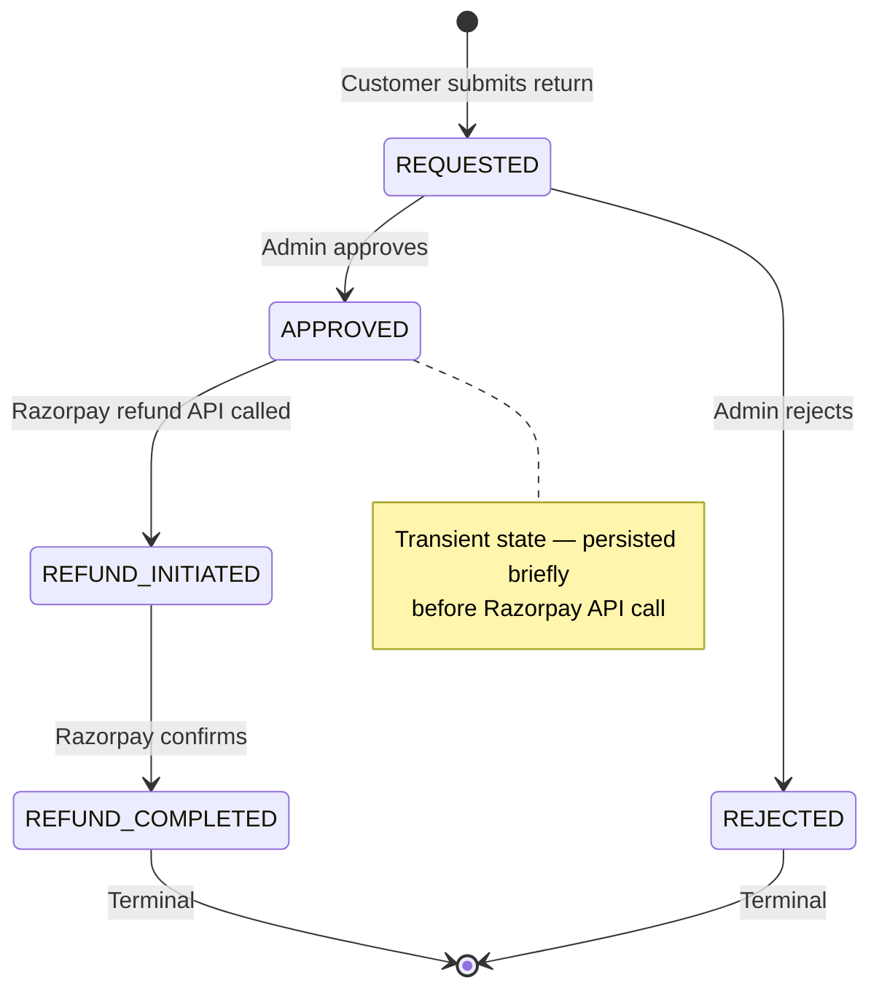
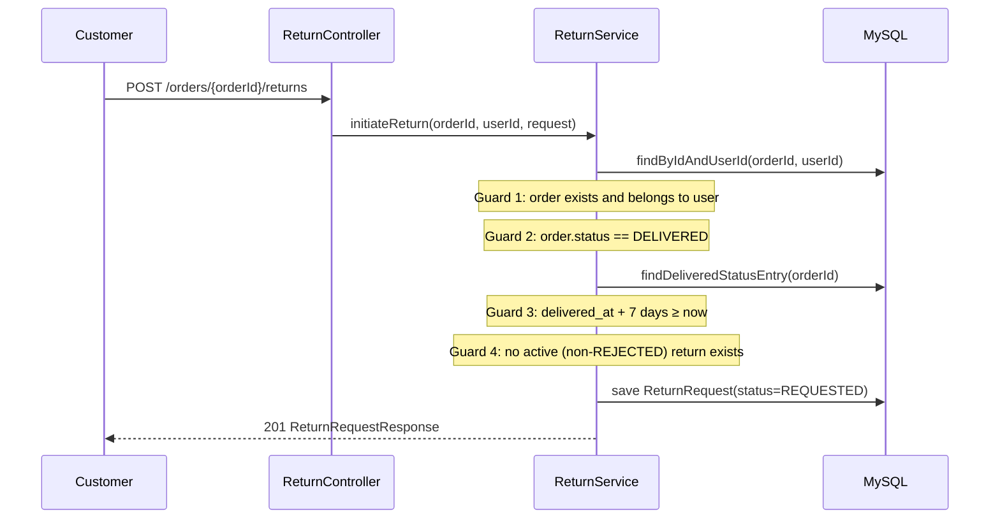
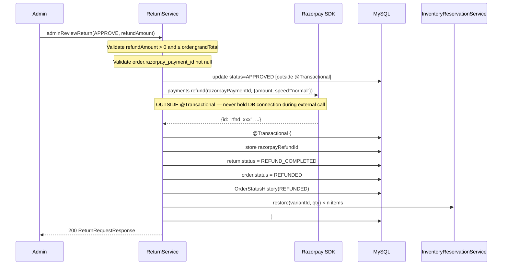

# Returns & Refunds

> ⚠️ **Note:** The previous `docs/backend/returns-refunds.md` was deleted — it described a different state machine (`PICKUP_SCHEDULED`, `ITEM_RECEIVED`) that does not exist in the source code and used the wrong timestamp for the 7-day return window.  
> This document is reconstructed from source: `ReturnStatus.java`, `ReturnService.java`, and `ReturnRequest.java`.

## What

Customers can request a return within **7 days of delivery**. Admins approve or reject requests. Approved returns trigger a Razorpay refund and restore inventory. The entire flow is audit-logged via append-only status transitions.

## Why

E-commerce platforms must support returns to comply with consumer protection norms and build buyer confidence. The 7-day window matches industry standard (Myntra, Flipkart). Razorpay's refund API handles the money movement without requiring EGO to hold funds.

## Architecture



**State definitions (source-verified from `ReturnStatus.java`):**

| State | Description |
|---|---|
| `REQUESTED` | Customer submitted; awaiting admin review |
| `APPROVED` | Admin approved; Razorpay refund about to be initiated. **Transient** |
| `REFUND_INITIATED` | Razorpay API called successfully; processing |
| `REFUND_COMPLETED` | Razorpay confirmed the refund. Order → `REFUNDED`. **Terminal** |
| `REJECTED` | Admin rejected. Customer may resubmit after rejection. **Terminal** |

> ⚠️ `PICKUP_SCHEDULED`, `ITEM_RECEIVED`, and `RETURN_IN_TRANSIT` **do not exist** in this codebase.

## Backend

**Module:** `com.ego.raw_ego.returns`

| File | Responsibility |
|---|---|
| `ReturnRequest.java` | JPA entity — `order_id`, `requested_by`, `reason`, `reason_detail`, `status`, `refund_amount`, `razorpay_refund_id`, `admin_notes`, `version` (optimistic lock) |
| `ReturnStatus.java` | State machine enum + `assertValidAdminTransition()` guard |
| `ReturnReason.java` | `DEFECTIVE`, `WRONG_ITEM`, `SIZE_ISSUE`, `NOT_AS_DESCRIBED`, `OTHER` |
| `ReturnService.java` | Business logic — guard checks, Razorpay refund, inventory restore |
| `ReturnController.java` | 5 REST endpoints |

**Initiate return flow:**



**Admin approval flow (source-verified from `ReturnService.java`):**



**Critical architecture rules in this module:**

1. **7-day window source of truth:** `OrderStatusHistory` entry where `status = DELIVERED`, column `created_at`. **NOT** `order.updatedAt` (BUG-005 — `updatedAt` advances on every mutation and would reset the window).
2. **External call outside `@Transactional`:** Razorpay `payments.refund()` is called outside any transaction boundary.
3. **Inventory pre-snapshot:** `orderItems` are loaded into a plain `ArrayList` before any `restore()` calls to prevent `LazyInitializationException` from `@Modifying(clearAutomatically = true)`.

## Frontend

**Module:** `raw-ego-frontend/src/features/returns/`

| File | Description |
|---|---|
| `src/types/return.types.ts` | `ReturnReason`, `ReturnStatus` union types + `ReturnRequest`, `InitiateReturnPayload`, `AdminReviewReturnPayload` interfaces |
| `src/api/return.api.ts` | 5 API functions via `apiClient` |
| `features/returns/hooks/useReturns.ts` | 5 TanStack Query hooks |
| `features/returns/admin/pages/AdminReturnsPage.tsx` | Admin returns list with status filter |
| `features/returns/admin/pages/AdminReturnDetailPage.tsx` | Admin approve/reject UI |

**Customer entry point:** From `CustomerOrderDetailPage.tsx` — "Request Return" button visible only when `order.status == DELIVERED` and within the 7-day window.

## Database

**Table:** `return_requests`

| Column | Type | Notes |
|---|---|---|
| `id` | BIGINT UNSIGNED | PK, auto-increment |
| `order_id` | BIGINT UNSIGNED | FK → `orders.id` (must be UNSIGNED to match) |
| `requested_by` | BIGINT UNSIGNED | FK → `users.id` |
| `reason` | ENUM | `DEFECTIVE, WRONG_ITEM, SIZE_ISSUE, NOT_AS_DESCRIBED, OTHER` |
| `reason_detail` | VARCHAR(1000) | Customer narrative (nullable) |
| `status` | ENUM | `REQUESTED, APPROVED, REFUND_INITIATED, REFUND_COMPLETED, REJECTED` |
| `refund_amount` | DECIMAL(10,2) | Admin-specified on approval (nullable until approved) |
| `razorpay_refund_id` | VARCHAR(100) | Format: `rfnd_XXXXXXXXXXXXXXXXXX` (nullable until approved) |
| `admin_notes` | VARCHAR(500) | Admin note on approval/rejection (nullable) |
| `version` | BIGINT | Optimistic lock |
| `created_at` | DATETIME | Immutable — request submission time |
| `updated_at` | DATETIME | Last mutation time |

**FK type note:** `order_id` must be `BIGINT UNSIGNED` — `orders.id` is unsigned. Signed/unsigned mismatch causes FK creation failure (Bug ES-5 pattern).

## API

### Customer Endpoints (JWT required)

**`POST /api/v1/orders/{orderId}/returns`**
```json
// Request
{
  "reason": "DEFECTIVE",
  "reasonDetail": "Zipper broke after first use"
}
// Response 201
{
  "id": 1, "orderId": 42, "status": "REQUESTED",
  "reason": "DEFECTIVE", "reasonDetail": "Zipper broke after first use",
  "createdAt": "2026-06-06T15:00:00Z"
}
```

**`GET /api/v1/orders/{orderId}/returns`** — Get return status for an order

### Admin Endpoints (ROLE_ADMIN required)

**`GET /api/v1/admin/returns`** — List all returns, optional `?status=REQUESTED`

**`GET /api/v1/admin/returns/{returnId}`** — Return detail

**`PUT /api/v1/admin/returns/{returnId}/review`**
```json
// Approve
{ "action": "APPROVE", "refundAmount": 1299.00, "adminNotes": "Verified photo" }

// Reject
{ "action": "REJECT", "adminNotes": "Return window has passed" }
```

## Validation Rules

**Initiation guards (all must pass):**
1. `order.user_id == authenticated user` — enforces ownership
2. `order.status == DELIVERED` — only delivered orders eligible
3. `OrderStatusHistory(DELIVERED).created_at + 7 days ≥ now` — within return window
4. `NOT existsByOrderIdAndStatusNot(REJECTED)` — no duplicate active return

**Approval guards:**
1. `refundAmount > 0` — no zero-amount refunds
2. `refundAmount ≤ order.grandTotal` — cannot refund more than paid
3. `order.razorpay_payment_id IS NOT NULL` — cannot refund cash/COD orders

**State machine guard:** `ReturnStatus.assertValidAdminTransition(current, next)` — throws `IllegalArgumentException` on invalid transitions.

## Security

- Customer can only view/initiate returns for their own orders (`findByIdAndUserId` ownership check)
- Admin can view all returns and approve/reject
- Order ID enumeration prevented: returns 404 (not 403) when cross-user access attempted
- `REFUNDED` order status can only be set via the returns module — admin status endpoint explicitly blocks this transition

## Known Limitations

- **Cash on Delivery (COD) orders cannot be refunded** — `razorpay_payment_id` must be non-null. COD refunds require manual bank transfer (not automated).
- **No partial item returns** — return is for the entire order, not individual line items
- **No return label / logistics integration** — EGO does not schedule pickups. Returns are a financial transaction only.
- **Razorpay refund speed:** `speed: "normal"` means 5–7 business days to customer's bank. `speed: "optimum"` (instant, 2% surcharge) not implemented.

## Extension Points

- Add line-item level returns: extend `ReturnRequest` with `return_items` junction table
- Add pickup scheduling: integrate with a logistics API (Shiprocket, Delhivery) after `APPROVED` state
- Add `speed: "optimum"` option for premium/VIP customers
- Implement partial refunds: admin specifies refund for a subset of order total

## Source References

- `raw-ego/src/main/java/com/ego/raw_ego/returns/enums/ReturnStatus.java`
- `raw-ego/src/main/java/com/ego/raw_ego/returns/service/ReturnService.java`
- `raw-ego/src/main/java/com/ego/raw_ego/returns/entity/ReturnRequest.java`
- `docs/database/schema_return_module.sql`
- Bug fix: BUG-005 (June 6, 2026) — return window timestamp source changed from `order.updatedAt` to `OrderStatusHistory.DELIVERED.created_at`
