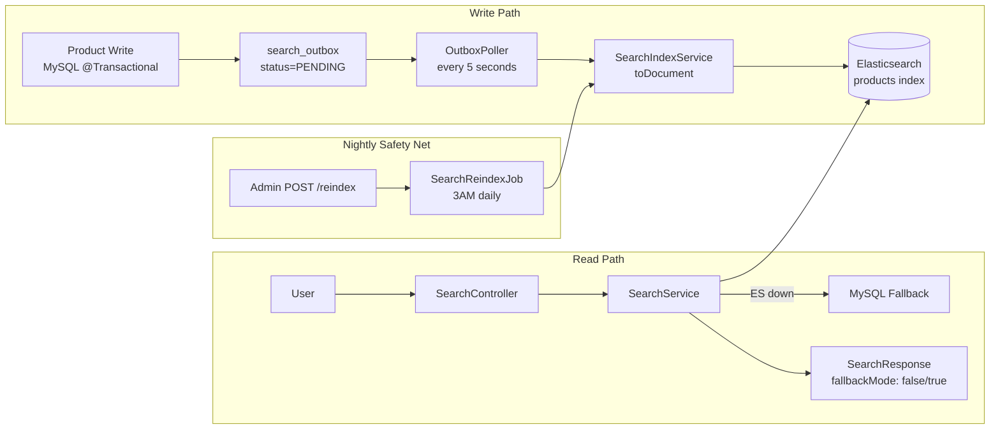
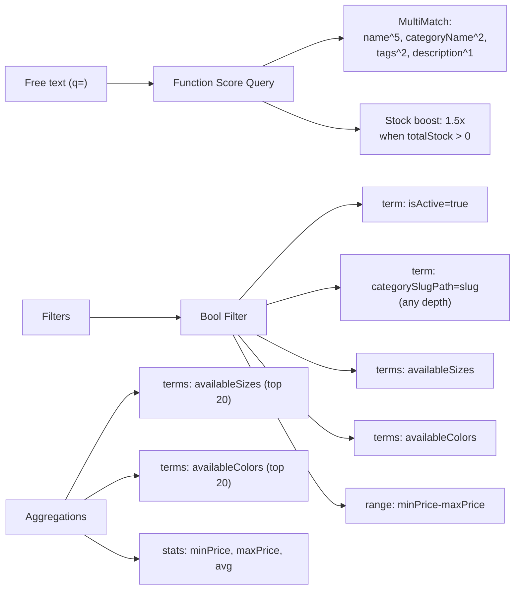

# Search (Elasticsearch)

## What

Full-text, faceted product search powered by Elasticsearch 9.0.1. Supports free-text queries, category filtering (at any hierarchy level), size/color facets, price range filters, and autocomplete. All product visibility changes propagate to ES via a crash-safe transactional outbox pattern.

## Why

MySQL `LIKE '%query%'` queries do not support relevance ranking, fuzzy matching, autocomplete, or aggregation-based facets at scale. Elasticsearch provides all of these in a single query, with sub-100ms response times on the product catalog.

## Architecture



## Backend

**Module:** `com.ego.raw_ego.search`

| File | Responsibility |
|---|---|
| `ProductDocument.java` | ES document (`@Document(indexName="products")`) |
| `SearchService.java` | Faceted search query, autocomplete, circuit breaker |
| `SearchIndexService.java` | MySQL → ES document builder, bulk index |
| `OutboxPoller.java` | `@Scheduled(fixedDelay=5000)` — polls 100 PENDING entries |
| `SearchReindexJob.java` | Full reindex on demand or nightly (3AM cron) |
| `SearchOutboxEntry.java` | Outbox entity — `product_id`, `status` (PENDING/DONE), `created_at` |

**ES Index configuration:**
- Settings: `raw-ego/src/main/resources/elasticsearch/product-index-settings.json`
- Mappings: `raw-ego/src/main/resources/elasticsearch/product-index-mappings.json`

**Custom analyzers:**

| Analyzer | Applied to | Behavior |
|---|---|---|
| `autocomplete_analyzer` | `name` field (index time) | edge_ngram (min=2, max=15) — prefix matching |
| `autocomplete_search_analyzer` | `name` field (search time) | standard tokenizer — no ngram at query time |
| `search_analyzer` | `description` | lowercase + asciifolding |

### ProductDocument Fields (source-verified from `ProductDocument.java`)

| Field | Type | Description |
|---|---|---|
| `id` | Long | Product ID |
| `name` | String | Uses autocomplete_analyzer |
| `description` | String | Uses search_analyzer |
| `slug` | String (keyword) | URL slug |
| `categoryId` | Long | Leaf category ID |
| `categoryName` | String | Leaf category display name |
| `categoryPath` | `List<String>` | Full ancestry display names: `["MEN", "Topwear", "T-Shirts"]` |
| `categorySlugPath` | `List<String>` | Full ancestry slugs: `["men", "topwear", "t-shirts"]` |
| `tags` | `List<String>` | Product tags (keyword) |
| `primaryImageUrl` | String | Hero image URL (stored, not indexed) |
| `availableSizes` | `List<String>` | e.g. `["XS", "S", "M", "L", "XL"]` |
| `availableColors` | `List<String>` | e.g. `["Black", "White", "Navy"]` |
| `colorHexCodes` | `List<String>` | e.g. `["#000000", "#FFFFFF", "#1C3D6E"]` (stored only) |
| `minPrice` | Double | Lowest variant price |
| `maxPrice` | Double | Highest variant price |
| `totalStock` | Integer | Total units across all variants |
| `avgRating` | Float | Average rating (1.0–5.0) |
| `reviewCount` | Integer | Total review count |
| `isActive` | Boolean | `false` for DRAFT/ARCHIVED — always filtered in search |
| `updatedAt` | Instant | Last index time |

### Search Query Construction



### Circuit Breaker

```java
try {
    return searchService.searchES(request);
} catch (Exception e) {
    log.warn("ES search failed, falling back to MySQL");
    FacetedSearchResponse response = searchService.searchMySQL(request);
    response.setFallbackMode(true);  // Signals frontend to show degraded mode banner
    return response;
}
```

## Frontend

**Module:** `raw-ego-frontend/src/features/search/`

| Component | Description |
|---|---|
| `ProductListingPage.tsx` | Search results page — renders filters panel + product grid |
| Facet filters | Size checkboxes, color swatches, price range slider |
| Fallback banner | Shown when `response.fallbackMode == true` |
| Autocomplete | Search bar typeahead — min 2 chars, up to 5 suggestions |

**TanStack Query hooks:**
```typescript
useSearch(params)         // Faceted search query
useAutocomplete(q)        // Autocomplete suggestions
```

## Database

**`search_outbox` table:**
| Column | Type | Notes |
|---|---|---|
| `id` | BIGINT | PK |
| `product_id` | BIGINT | FK → products.id |
| `operation` | VARCHAR | `INDEX` or `DELETE` |
| `status` | ENUM | `PENDING`, `DONE` |
| `created_at` | DATETIME | Entry time |
| `processed_at` | DATETIME | Completion time (nullable) |

⚠️ DONE entries are not cleaned up automatically — periodic purge not yet implemented.

## API

### Public Endpoints (no auth required)

**`GET /api/v1/search`**

Query parameters:
| Param | Type | Example | Description |
|---|---|---|---|
| `q` | String | `"oversized tee"` | Free-text query (optional) |
| `categorySlug` | String | `"men"` | Filter by category slug (any level) |
| `sizes` | String[] | `["S", "M"]` | Filter by available sizes |
| `colors` | String[] | `["Black"]` | Filter by color name |
| `minPrice` | Double | `500` | Min price filter |
| `maxPrice` | Double | `3000` | Max price filter |
| `page` | Int | `0` | Page number (0-indexed) |
| `size` | Int | `20` | Page size |
| `sort` | String | `"price_asc"` | Sort order |

**Response:**
```json
{
  "products": [
    {
      "id": 1, "name": "Classic Black Tee", "slug": "classic-black-tee",
      "minPrice": 999.0, "maxPrice": 1299.0,
      "availableSizes": ["S", "M", "L"],
      "availableColors": ["Black"],
      "primaryImageUrl": "https://res.cloudinary.com/...",
      "avgRating": 4.5, "reviewCount": 12
    }
  ],
  "totalElements": 45,
  "totalPages": 3,
  "facets": {
    "sizes": [{"value": "M", "count": 30}, {"value": "L", "count": 25}],
    "colors": [{"value": "Black", "count": 40}],
    "priceStats": { "min": 499.0, "max": 4999.0, "avg": 1499.0 }
  },
  "fallbackMode": false
}
```

**`GET /api/v1/search/autocomplete?q=ho`**
```json
["hoodies", "hoodie crop", "hood jacket"]
```
- Minimum 2 characters required
- Maximum 5 suggestions
- Uses edge-ngram prefix matching on product names

### Admin Endpoints (ROLE_ADMIN required)

**`POST /api/v1/admin/search/reindex`** — Full product reindex from MySQL → ES

## Validation Rules

- `q` param: minimum 0 characters (empty = match-all with filters)
- `sizes`, `colors`: normalized at source (ES-4 bug: inconsistent naming caused 0 results — values now standardized: `S, M, L, XL` abbreviations)
- `categorySlug`: `term` filter against `categorySlugPath[]` keyword array — exact slug match at any tree level

## Security

- `/api/v1/search` and `/api/v1/search/autocomplete` are in `SecurityConfig.PUBLIC_MATCHERS` — no auth required
- Admin reindex endpoint requires `ROLE_ADMIN`
- ES is not directly exposed — all queries go through `SearchService` which always adds `isActive=true` filter

## Known Limitations

- Up to **5-second propagation delay** from product change to ES visibility
- `search_outbox` DONE entries accumulate — no cleanup job yet
- `OutboxPoller` is single-node — not suitable for multi-instance without distributed lock
- No trending searches endpoint yet (see `BACKEND_REQUIREMENTS_FROM_FRONTEND.md` §2)
- No "Recently Viewed" feature yet

## Extension Points

- Add `GET /api/v1/search/trending` — aggregate search log queries, return top 5
- Add `GET /api/v1/products/{id}/related` — ES More Like This or category-based recommendation
- Add did-you-mean suggestions (ES `phrase_suggester`)
- Add `search_outbox` cleanup job (delete DONE entries older than 7 days)
- Multi-instance outbox: use Redis distributed lock or switch to Kafka

## Source References

- `raw-ego/src/main/java/com/ego/raw_ego/search/document/ProductDocument.java`
- `raw-ego/src/main/java/com/ego/raw_ego/search/service/SearchService.java`
- `raw-ego/src/main/java/com/ego/raw_ego/search/job/OutboxPoller.java`
- `raw-ego/src/main/resources/elasticsearch/product-index-settings.json`
- ADR: `docs/13-decisions/architecture-decision-records/ADR-002-search-outbox-pattern.md`
