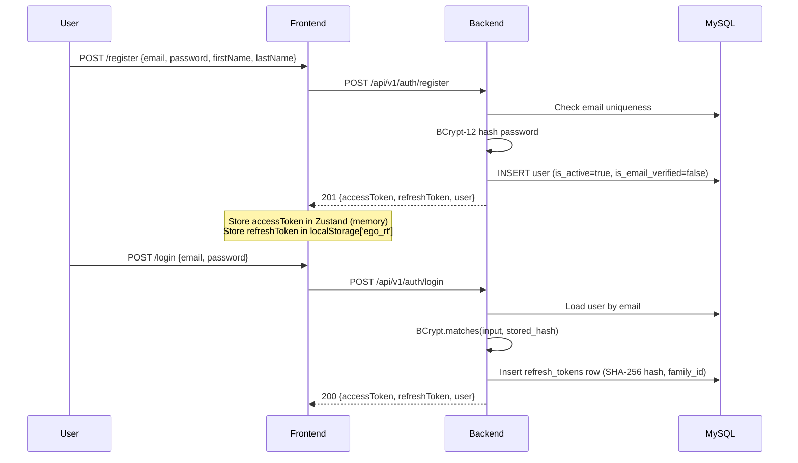
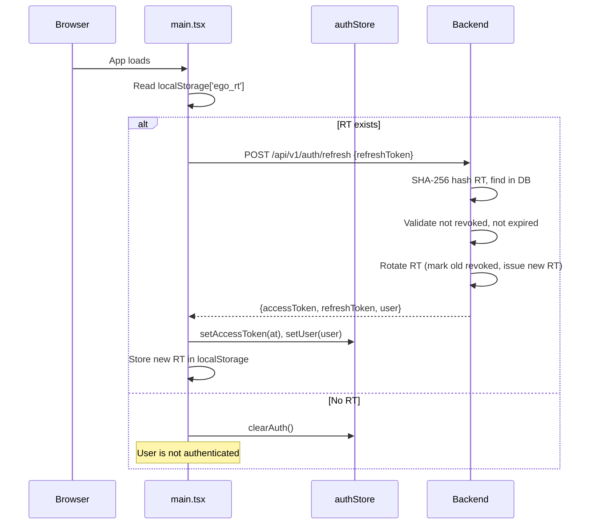
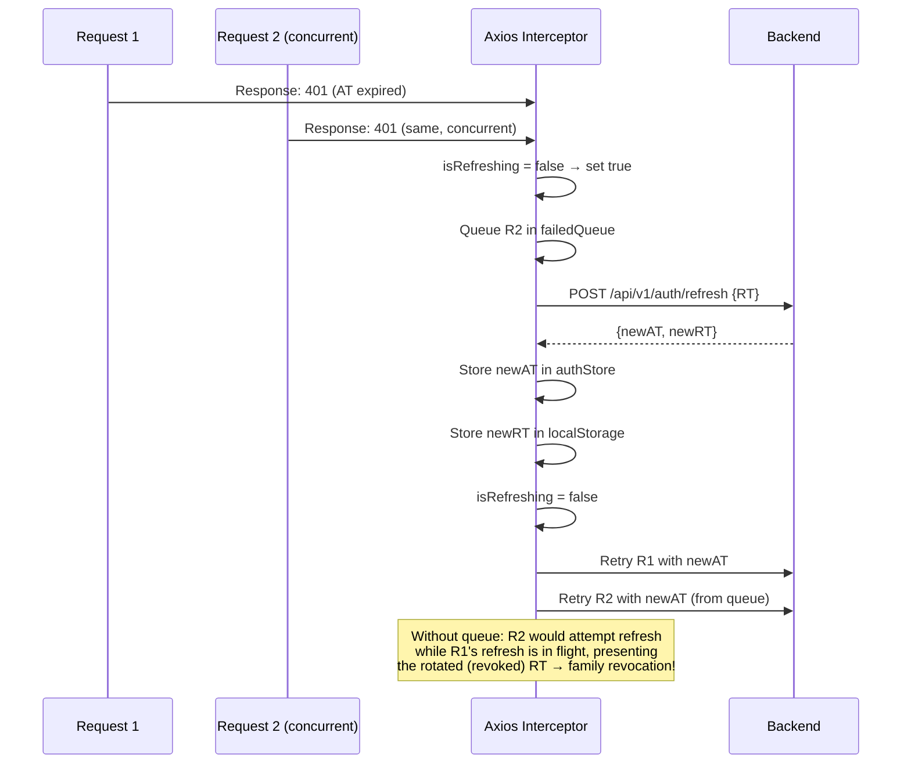
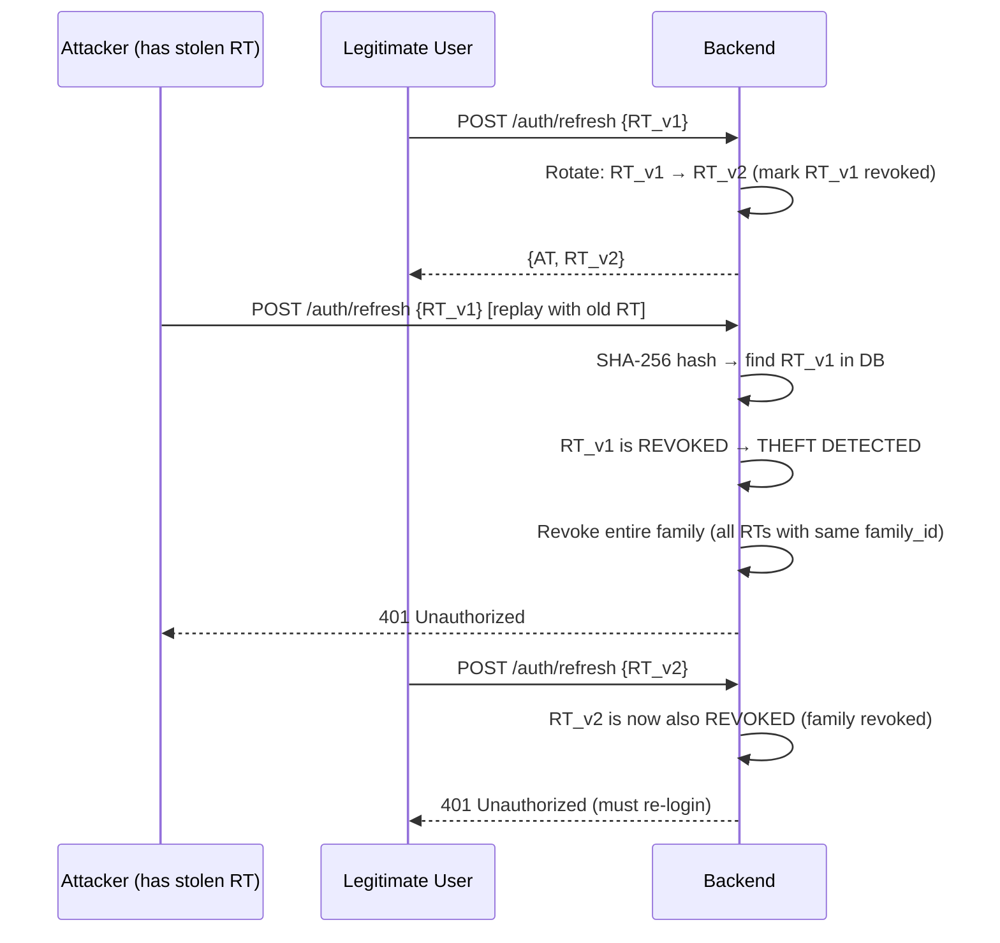
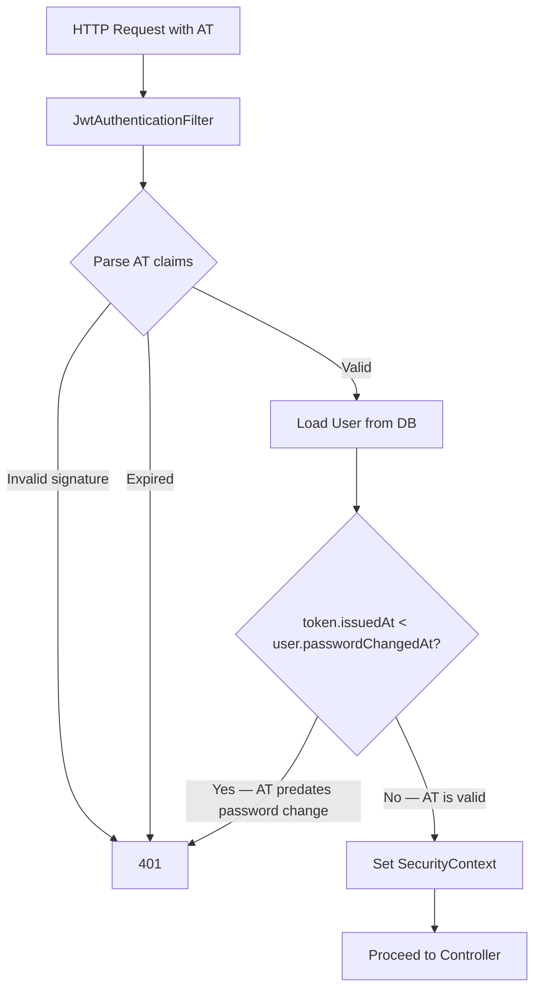
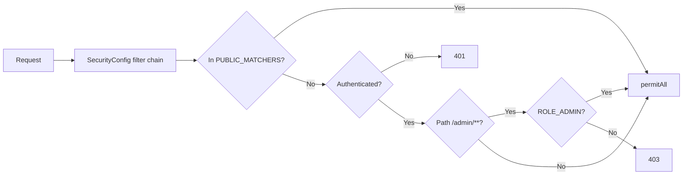

# Authentication Flow

> All values verified against source: `JwtService.java`, `RefreshTokenService.java`, `JwtAuthenticationFilter.java`, `client.ts`.

---

## Registration & Login

---

## App Boot (Persisted Session Restore)

---

## Silent AT Refresh (401 Interceptor)

---

## Token Theft Detection

---

## `passwordChangedAt` Guard

---

## RBAC — Route Access Control

**PUBLIC_MATCHERS (no auth required):**
- `GET /api/v1/categories/**`
- `GET /api/v1/products/**`
- `GET /api/v1/search`, `GET /api/v1/search/autocomplete`
- `GET /api/v1/coupons/validate`
- `POST /api/v1/auth/register`, `POST /api/v1/auth/login`, `POST /api/v1/auth/refresh`
- `POST /api/v1/webhooks/razorpay`
- `GET /api/v1/products/{id}/reviews`, `GET /api/v1/products/{id}/reviews/summary`
- `/docs/**` (Swagger UI)

**Requires ROLE_ADMIN:** All `/api/v1/admin/**` paths
