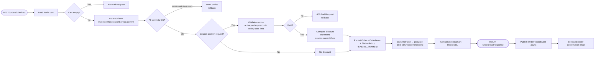
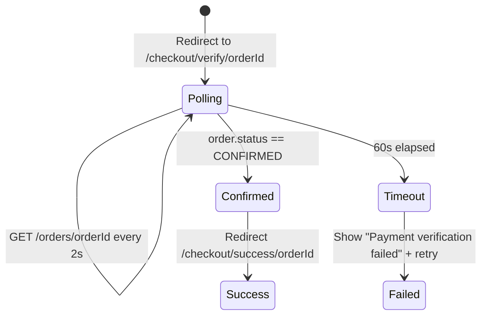
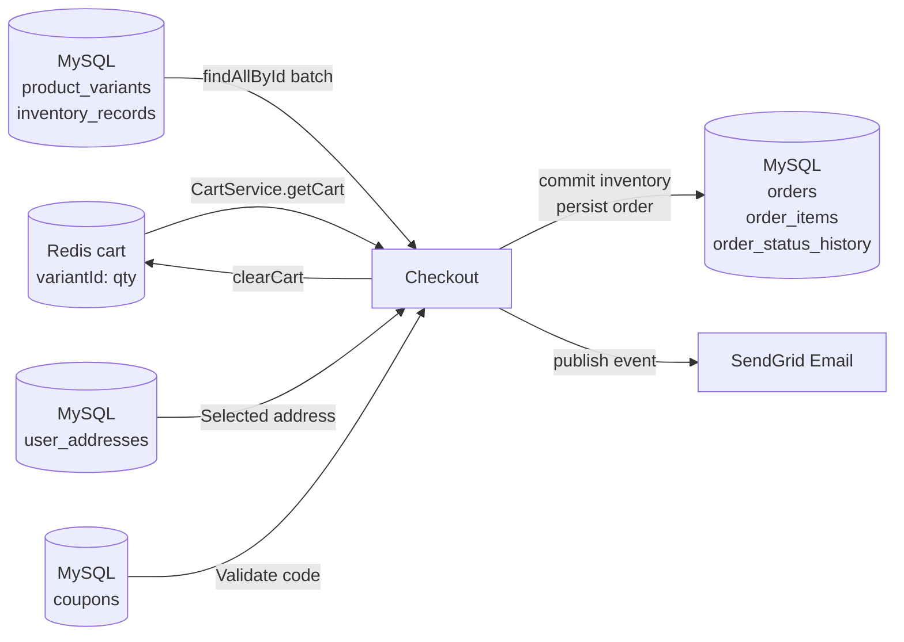

# Checkout Flow

> Source-verified from `OrderService.checkout()`, `InventoryReservationService.commit()`, and `CheckoutPage.tsx`.

---

## End-to-End Checkout Journey

```mermaid
flowchart TD
    A[Customer clicks Checkout] --> B[/checkout route\nProtectedRoute guard]
    B --> C{Authenticated?}
    C -->|No| Login[Redirect to /login]
    C -->|Yes| D[CheckoutPage.tsx\nMUI Stepper]

    subgraph Step 1: Address
        D --> E{Has saved addresses?}
        E -->|Yes| F[Select from address book]
        E -->|No| G[Enter new address]
        F --> H[Continue]
        G --> H
    end

    subgraph Step 2: Review Cart
        H --> I[Display cart items\nlive prices, qty]
        I --> J{Apply coupon?}
        J -->|Yes| K[GET /coupons/validate?code=&subtotal=]
        K --> L{Valid?}
        L -->|Yes| M[Show discount preview]
        L -->|No| N[Show error]
        J -->|No| O[Show subtotal + shipping]
        M --> O
    end

    subgraph Step 3: Payment
        O --> P[Click Pay Now]
        P --> Q[POST /payments/razorpay/create]
        Q --> R[Open Razorpay Checkout.js modal]
        R --> S{Payment outcome}
        S -->|Success| T[Razorpay sends webhook to backend]
        S -->|Failure/Cancel| U[Stay on checkout]
        T --> V[Backend: PENDING_PAYMENT → CONFIRMED]
        V --> W[Poll GET /orders/orderId until CONFIRMED]
        W --> X[Redirect: /checkout/success/orderId]
    end
```

---

## Backend Checkout Pipeline (`@Transactional`)



---

## Coupon Discount Formula

```
subtotal = sum(item.unitPrice × item.quantity)

if FLAT:
    discount = min(coupon.discountValue, subtotal)
    
if PERCENTAGE:
    discount = subtotal × (coupon.discountPercent / 100)
    if coupon.maxDiscountAmount is set:
        discount = min(discount, coupon.maxDiscountAmount)

grandTotal = max(subtotal - discount, 0) + shippingTotal
```

---

## Payment Verification Page

After Razorpay Checkout.js modal closes:



---

## Cart → Checkout → Order Data Flow


