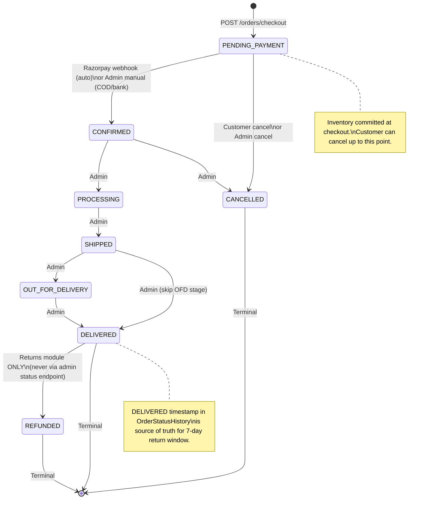
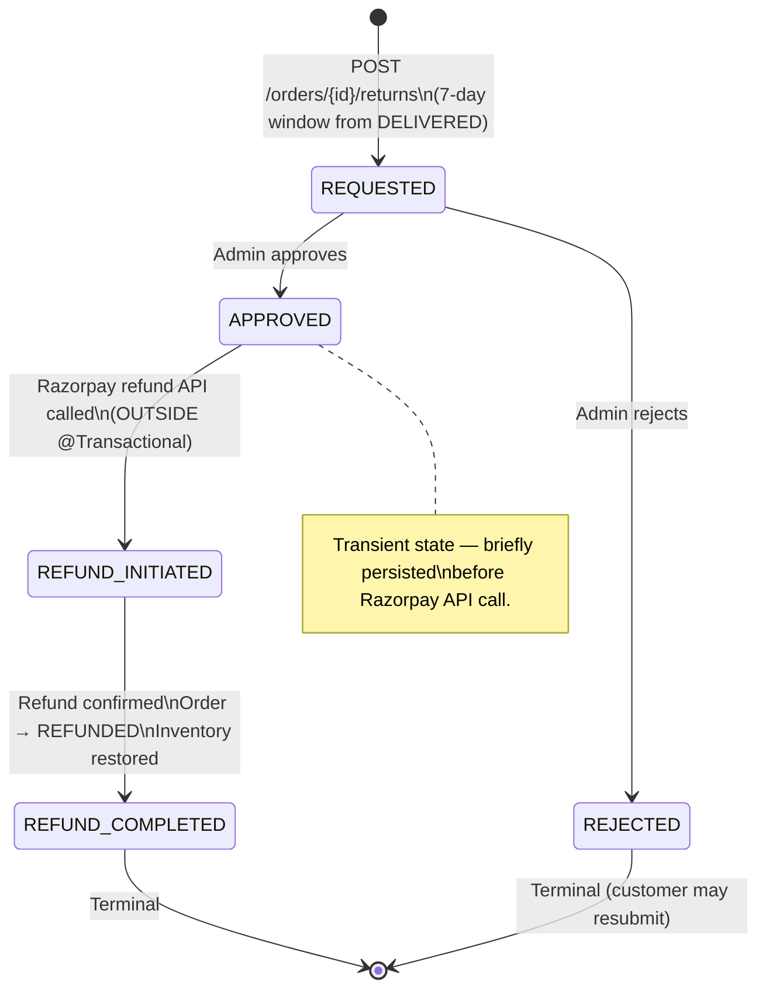
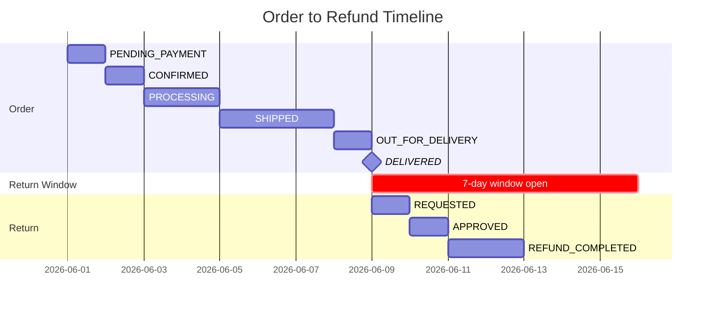

# Order Lifecycle

> All states and transitions verified against `OrderStatus.java` and `ReturnStatus.java`. State machines are exact representations of the source enum switch statements.

---

## Order Status Machine



---

## Return Status Machine



---

## Combined Timeline: Order + Return



---

## Inventory State Through Order Lifecycle

```mermaid
flowchart LR
    subgraph Cart
        A["qty_available: 10<br/>qty_reserved: 0"]
        A -->|Add to cart<br/>reserve(5)| B
        B["qty_available: 10<br/>qty_reserved: 5"]
    end

    subgraph Checkout
        B -->|commit(5)<br/>@Transactional| C
        C["qty_available: 5<br/>qty_reserved: 0"]
    end

    subgraph CancelOrReturn
        C -->|restore(5)<br/>cancel or refund| D
        D["qty_available: 10<br/>qty_reserved: 0"]
    end
```

---

## Admin State Transition Rules (source-verified)

| From | To | Trigger |
|---|---|---|
| `PENDING_PAYMENT` | `CONFIRMED` | Admin manual (COD) or Razorpay webhook |
| `PENDING_PAYMENT` | `CANCELLED` | Customer cancel or admin cancel |
| `CONFIRMED` | `PROCESSING` | Admin |
| `CONFIRMED` | `CANCELLED` | Admin |
| `PROCESSING` | `SHIPPED` | Admin |
| `SHIPPED` | `OUT_FOR_DELIVERY` | Admin |
| `SHIPPED` | `DELIVERED` | Admin (skip OFD) |
| `OUT_FOR_DELIVERY` | `DELIVERED` | Admin |
| `DELIVERED` | `REFUNDED` | **Returns module only** — blocked on admin status endpoint |

**Blocked transitions** (all throw `400 Invalid status transition`):
- Any backward transition (e.g. `SHIPPED → CONFIRMED`)
- `DELIVERED → CANCELLED`
- Setting `REFUNDED` via admin status endpoint
- Any transition from terminal states (`DELIVERED`, `CANCELLED`, `REFUNDED`)
