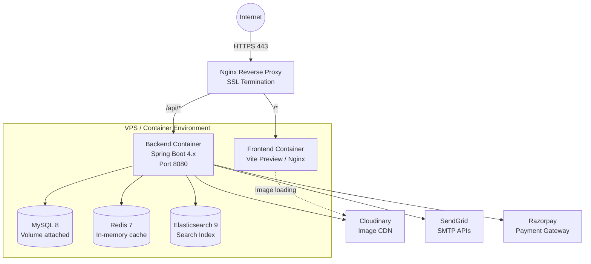

# Production Deployment Guide (Phase 15 Pending)

> **Status:** Pending implementation. This document outlines the planned deployment architecture for Phase 15. The system currently runs locally via Docker Compose and Vite dev server.

## Architecture Target

The production environment will use a single VPS (e.g., DigitalOcean Droplet, AWS EC2) or a managed PaaS container environment.



## Infrastructure Requirements

### Minimum Specs
- **RAM:** 4GB minimum (ES requires ~1GB, Spring Boot ~1GB, MySQL ~1GB)
- **CPU:** 2 Cores
- **Storage:** 40GB SSD (Database + ES Index + Logs)

### External Dependencies
These must be provisioned and their secrets injected via environment variables:
1. **Cloudinary** (Image CDN)
2. **SendGrid** (Transactional Emails)
3. **Razorpay** (Payments)
4. **Domain Name** (DNS pointing to VPS IP)

## Deployment Steps (Conceptual)

1. **Build Backend:**
   ```bash
   ./mvnw clean package -DskipTests
   # Produces target/raw-ego-0.0.1-SNAPSHOT.jar
   ```

2. **Build Frontend:**
   ```bash
   npm run build
   # Produces dist/ folder (static assets)
   ```

3. **Docker Compose (Production):**
   A `docker-compose.prod.yml` will be created combining:
   - Backend `.jar` executed in a JDK 21 container.
   - Frontend `dist/` served via a lightweight Nginx container.
   - MySQL 8, Redis 7, ES 9.0.1.

4. **Nginx Reverse Proxy:**
   - Host machine Nginx routes `example.com` to the frontend container.
   - Routes `example.com/api` to the backend container.
   - Handles Let's Encrypt SSL termination (Certbot).

## Production Security Considerations

- **Secrets:** Use `.env` files not checked into Git, or a secret manager. Never hardcode `JWT_SECRET`.
- **Razorpay Webhooks:** Ensure the endpoint is secured with `RAZORPAY_WEBHOOK_SECRET` validation (already implemented in `WebhookController`).
- **Elasticsearch:** In production, do NOT expose port 9200 to the public internet. `xpack.security.enabled` should be `true` or heavily firewalled.
- **CORS:** Update `SecurityConfig.java` to restrict CORS from `*` to the actual production domain name.
- **MySQL Backup:** Setup a cron job for `mysqldump` to an external S3 bucket.
